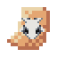
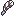

# 🪄 Custom Enchantments

## **How Are Custom Enchants Obtained?** .png>)

You can either do /ce and buy a random rarity book using exp, or get lucky and get one when using an enchanting table. Once receiving a custom book to apply the enchant put into an anvil with your item.

#### Each section of the Custom Enchantment GUI is color-coded so it's easier to process.

<figure><figcaption>
Marked Custom Enchants Menu
</figcaption></figure>

**Ok let's now explain what's what:**\
\
<mark style="color:yellow;">**Yellow Area**</mark>\
Here you're able to choose which random enchant book you'd like to buy, sorted by rarity.\
\
<mark style="color:red;">**Red Area**</mark>\
When clicking on the anvil icon in the marked red area you'll be taken to the alchemist menu.

In the alchemist menu you're able to combine two enchantment books of the same type and rarity and level to get a higher leveled book.

It basically works like an anvil.\
\
<mark style="color:green;">**Green Area**</mark>\
In the Tinkerer menu you're able to re-cycle old enchanted items into EXP bottles.\
\
<mark style="color:blue;">**Blue Area**</mark>\
This is the custom enchant item shop menu. You're able to buy items using EXP. Each item explained:

* Removal Scroll - Removes a random enchantment from an item & converts it into a random % success book
* Mob Kill Tracker - Track how many mob kills you have with a weapon.
* Block Tracker - Track how many blocks you have broken with a tool.
* Player Kill Tracker - Track how many player kills you have with a weapon.
* Soul Tracker - Apply to weapons to start tracking souls collected from kills.
* Soulbound Scroll - A legendary reward that can be applied to\
  armor/weapons, gives a chance of not losing the blessed item when you die.
* Transmog Scroll - Organizes enchants by rarity and adds a count lore to the item.
* Soul Gem - A Gem that contains a soul is used for specific enchants
* Slots Scroll - Increased the maximum value of how many custom enchantments can be put on an item the default being **6** and max increase being **10**.&#x20;
* Rename Quil - You're able to rename items by right-clicking this item, hovering over your select hotbar slot item, then typing in a name into the chat.\
  Color formatting codes work; [&0&1&2&3&4&5&6&7&8&9\&a\&b\&c\&d\&e\&f\&l\&o\&i\&n](https://minecraft.fandom.com/wiki/Formatting_codes).

