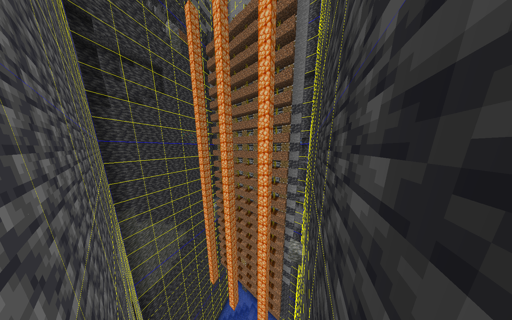

# 💸 How to earn in-game money?

There are 4 ways to easily earn in-game money 💸

* Automatic Farms
* Jobs
* Player Shops
* Manual Farming Techniques

## Automatic Farms&#x20;

There are many types of Automatic Farms that a player can build (most of which can be found via YouTube) \
\

<figure><figcaption>
(Example of an Automatic Melon Farm)
</figcaption></figure>

## Jobs

**Doing jobs** and earning money from the specific actions. Check out \
Mechanics > Jobs\

## Player Shops

**🛒Player Shops** can be a valid way of making in-game money, Most players use this to sell custom items they find throughout the various worlds or to sell items that don't have a buy price in /shop

## Manual Farming Techniques

**⛏️Excavating Ores**\
A Player can explore caves in-order to find ores of which the resulting drop can be sold in /shop

**🐑🗡️Breeding & Killing Passive Mobs**\
This is pretty self-explanatory\
\
**Manually Farm Crops**\
A Player can make a large-scale crop farm of which the resulting drops can be sold in /shop

