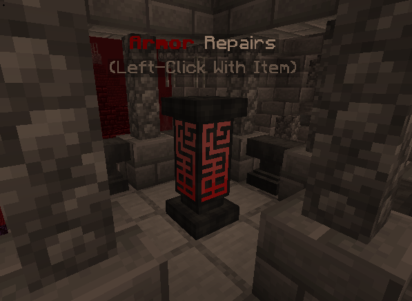

# 🐲 Progression Bosses

These bosses are recommended to be beaten as you progress through the different stages of the server. They are though and may need you to be prepared to face them head on. However, all of the bosses arenas have a repair stone you can use to get your gear patched up.

### Repair Stone

<figure><figcaption>
Cure-your-gear-inator
</figcaption></figure>

At the cost of 25 exp levels, you can repair any piece of gear to its max durability. Make sure to grind up some levels in [Durel](https://wiki.drgnshield.com/worlds/durel) before trying out your luck against these fearsome foes.
