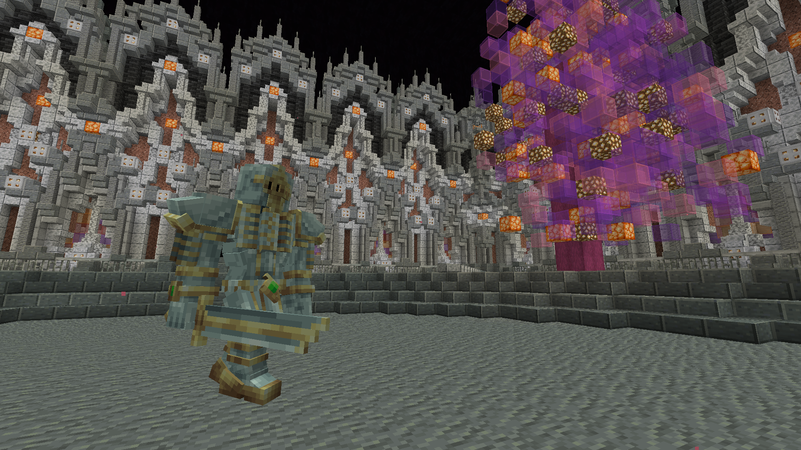

# ☦️ I Holy Knight

### Boss Location

You can find the Holy Knigt in the normal End (Via Portal One). Unlike with the other bosses you have to walk to this one. Once you enter a End Portal (One can be found at /pw Lootville), find a pillar with water and enderpearl into it, this will take you to the custom End Isles. Now go out and reach the cords of the <mark style="color:yellow;">**Holy Knight Boss Arena!**</mark>

* -97 154 3203\

<figure><figcaption>
Gabriel
</figcaption></figure>

### Lore

In the celestial realm of Elysium, where the purity of light reigns eternal, there existed an ancient portal shrouded in mystery and guarded by the most devout of angels. This portal, said to be a gateway to realms beyond mortal comprehension, lay dormant for eons, its purpose obscured by the sands of time.

It was through this ancient portal that the three brothers, Seraphiel, Gabriel, and Raphael, emerged into the mortal realm. Drawn by the whispers of darkness that echoed through the cosmos, the brothers ventured forth, their hearts heavy with the weight of their sacred duty.

As they stepped through the portal, they found themselves in a world unlike any they had ever known: A darkness, never seen before. Flying Rats, long corrupted elongated men. What have they've discovered

But even as they marveled at the wonders of this new world, the brothers knew that their mission was clear. With their swords held high and their spirits undaunted, they set forth to confront the darkness that threatened to engulf it, guided by the divine light that burned within their hearts.

For centuries, they wandered the mortal realm, battling against the forces of darkness wherever they found them, their presence a beacon of hope for all who dwelled in the shadow of fear. And though they faced countless trials and tribulations along the way, their faith never wavered, their resolve never faltered.

And so, it was through the ancient portal of Elysium that the Holy Knights of legend came to be, their journey an epic saga of sacrifice and redemption that would echo through the ages, inspiring all who heard of their valor and courage. And though the portal may have long since closed, its memory lives on in the hearts of those who still believe in the power of light to conquer even the darkest of nights.

### Stats

<mark style="color:yellow;">**The Holy Knights**</mark> have 5**k HP**. His path finding focuses on killing everything around it. Along side the Holy Knight Sword spinning attack which deals solid damage it has a couple of cool combos! And unlike other bosses it can be parried.

### Recommended Gear

It's recommend to have Prot 4 Netherite. This is an early stage boss after all and is meant for early game players.

### Drops

They drop the <mark style="color:yellow;">Holy Knight Souls,</mark> which can be traded with <mark style="color:yellow;">Solaire of Astora</mark> at /spawn.&#x20;

<figure><figcaption></figcaption></figure>

