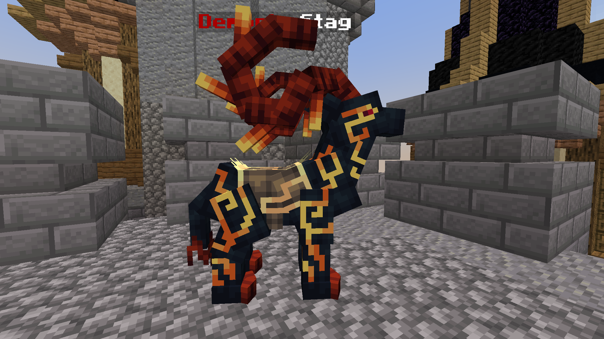
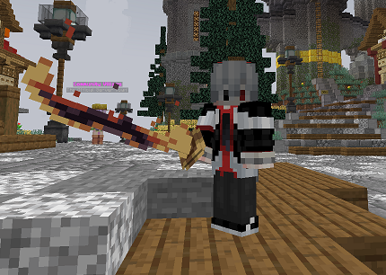
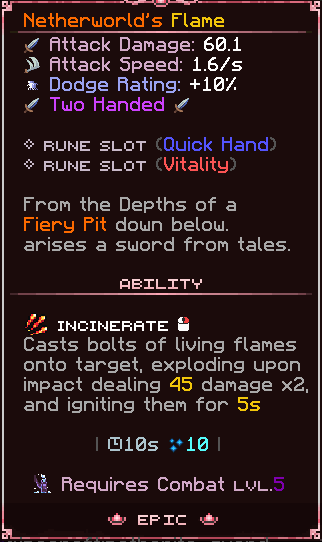

# 🔥 II Maalik The Forsaken

### Stag Location

The stag can be found on the left tower from spawn, you'll see some ladders. Once you climb those ladders, directly head behind on another set of ladders where you'll find the <mark style="color:red;">**Demonic**</mark> Stag.\

<figure><figcaption>
Demonic Stag
</figcaption></figure>

### Lore

In the annals of celestial history, there exists a tale of <mark style="color:red;">**Maalik The Forsaken**</mark>, once hailed as the Forsaken Angel. Cast from the lofty heights of his divine station, he now prowls the infernal realms, a pawn ensnared by the machinations of Hell itself. The echoes of his anguish resound still, a haunting lamentation born from the corruption of his once immaculate soul, now steeped in the depths of hatred and despair.\
\

<figure><figcaption></figcaption></figure>

### Stats

<mark style="color:red;">**Maalik The Forsaken**</mark> has two stages, each having **8k HP (with an extra 3k HP per player in the battle)**, and do notice normal arrows do not work on progression bosses! His path finding goes for the nearest target, which makes killing him in a party of geared people easier. His claw attack does though stop and lock in enemies, so be careful of that one. One if his strongest attacks is the Seismic Smash which does **40** damage to players in radius of 3 near him. His sword attack damage ranges from **25-35** depending on what attack pattern he uses. (long hit, short hit). Finally, he has a summon attack where he can summon two different Demon Minions, with a cooldown of 120 seconds per summon.

#### Ranged Minion

These small demons' arrows can deal up to **15** of per hit and have **120 HP.** Depending on Maalik's phase, one or two archers may spawn.

#### Meele Minion&#x20;

These guys can deal up to **10** damage per hit and have **60 HP**. Do be careful, as Maalik can spawn two of these guys. Very annoying during the fight, a good way to counter them is to assign a weaker party member to clear them.

### Recommended Gear

It's recommend to either have a party of [**Stage II**](../../progression-guide/stage-ii.md) (Malachite) players if you're taking him on early game.

If you wish to try to solo it, we truly do recommend Stage III gear, the further down [**Stage III**](../../progression-guide/stage-iii.md) the easier it will get. He's pretty tankable in Amber, while very survivable in Malachite. Make sure to have Unbreaking VI, EXP pots and Mending as your gear in early stages can be easily broken by this boss.&#x20;

### Drops

Each Progression Boss has their own weapon with custom mechanics and stats. <mark style="color:red;">**Maalik The Forsaken**</mark> is no different. He drops <mark style="color:red;">Netheworld's Flame</mark>. This weapon is not the original sword he carries with him but his true sword he had before the demonification process.\

#### Weapon Stats

Each boss weapon have margines in which the weapon damage and other stats scale. <mark style="color:red;">Netherworld's Flame</mark> has a couple of different stats.

* Attack Damage\
  `Base Damage = 60.0`\
  `Spread = 0.022`\
  `Max Spread = 0.048`
* Attack Speed\
  `Always the same = 1.6`
* Two Handed \
  `Can't be used with off hand Items`
* Quick Hand Rune Slot\
  `Buffs Attack Speed`
* Vitality Rune Slot\
  `Buffs HP Depending on Vitality Rune`
* Passive skill\
  `10 % dodge chance (60s cooldown)`
* Active Skill\
  `Incinerate (10 mana cost) = launches two bolts of fire which inflicts 45 damage per hit and ignite targets for 5 seconds (10s cooldown).`

<figure><figcaption></figcaption></figure>

<figure><figcaption>
Netherworld's Flame Preview
</figcaption></figure>

<mark style="color:red;">**Maalik The Forsaken**</mark> also has a 30-40% chance to drop two different cosmetics, Demonic Wings and Demonic Cosmetic Skull. We will not provide any images of the sword and cosmetics so you can experience their true beauty in-game.
