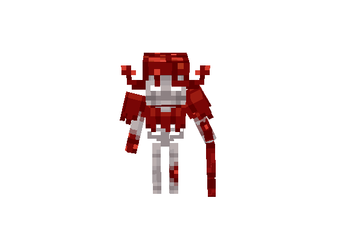
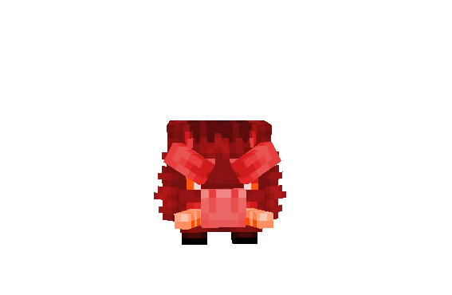
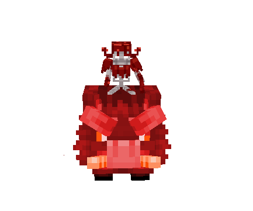
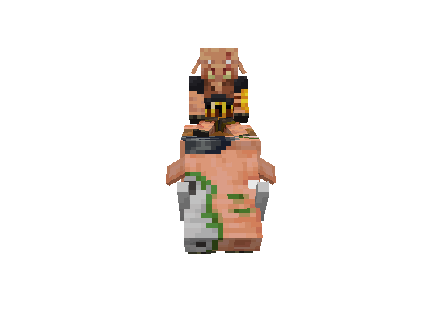
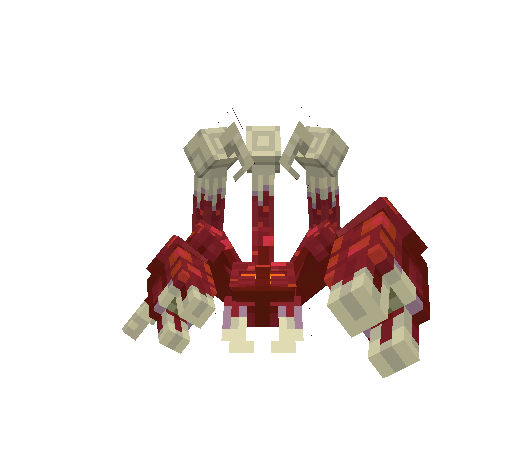

# 👹 Area Creatures

The **Crimson Forest** is infested with blood-soaked bones and wild beasts warped by corruption. Many of the creatures here fight in coordinated formations or charge in overwhelming packs. Combat in this jungle becomes chaotic quickly—especially when riders and mounts are involved.

***

#### ☠️ Crimson Skeleton

Once knights and hunters of the old world, these **Crimson Skeletons** were resurrected by the forest’s curse and now roam in coordinated groups or mounted assaults.

<figure><figcaption></figcaption></figure>

* **Base HP:** 200 ❤️ (+100 per additional player in combat)
* **Behavior:** Aggressive melee attackers, sometimes riding into battle on Crimson Boars.
* **Abilities:**
  * **Wicked Whip:** A brutal mid-range strike that deals high damage and ignores light armor.
  * **Bone Grasp:** Rarely, a whip strike can slow the player for a moment on hit.

> **Lore**: These skeletons still retain fragments of military discipline. You’ll find them in loose formations—walking the jungle floor, or mounted on corrupted beasts. Their whips are said to be fashioned from the sinew of fallen explorers.

***

#### 🐗 Crimson Boar

These bloated, furious beasts charge through the jungle with little thought, goring anything in their path.

<figure><figcaption></figcaption></figure>

* **Base HP:** 110 ❤️ (+100 per additional player)
* **Behavior:** Always aggressive, frequently used as mounts for Crimson Skeletons.
* **Abilities:**
  * **Gore Rush:** A straight-line charge that knocks players into the air and deals moderate damage.

> **Lore:** Once regular forest boars, the Crimson Plague twisted their forms and turned them hostile. Alone they’re manageable, but combined with mounted skeletons, they become a stampeding threat.

***

#### 🐎 Crimson Skeleton Rider _(Crimson Skeleton + Crimson Boar)_

The mounted form of the Crimson Skeleton, this enemy rushes into combat with devastating momentum.

<figure><figcaption></figcaption></figure>

* **Base HP:** Same as base components — 200 ❤️ for the **Skeleton**, 110 ❤️ for the **Boar** (each scales individually).
* **Behavior:** Attacks while charging with increased speed and aggression.
* **Mechanic:** If the **Boar** is slain first, the **Skeleton** dismounts and continues fighting.

> **Lore:** These riders are a terrifying sight in the forest—a blur of bone, whip, and tusk. Some say the forest grants them limited coordination, letting them flank and corner travelers who stray from the path.

***

#### 🐗 Piglin Rider (Zoglin Mount)

Feral and war-hardened, **Piglin Riders** have adapted to the Crimson Forest’s brutality by bonding with **Zoglins**, forming deadly cavalry units.

<figure><figcaption></figcaption></figure>

* **Base HP:** 150 ❤️ for **Piglin**, 110 ❤️ for **Zoglin** (+100 per player for both)
* **Abilities:**
  * **Cleave Strike (Piglin):** A wide swing that hits multiple targets.
  * **Zoglin Charge:** Similar to Crimson Boars but with more knockback and aggression.
* **Mechanic:** Like Skeleton Riders, if the **Zoglin** dies, the **Piglin** continues the fight on foot.

> **Lore:** No one knows how Piglins arrived here—but some say they were drawn by the forest’s latent gold and now serve it in exchange for power. Their Zoglins, once warped hogs, emit a constant roar that chills the bones.

🦂 **Crimson Scorpion**\
&#xNAN;_&#x4C;ocation: Found on the right path after the cave and the Deep Crimson Jungle._

A venomous predator that lurks among the cracked rocks and crimson flora, striking with deadly precision.

<figure><figcaption></figcaption></figure>

* **Base HP:** 200 ❤️
* **Behavior:** Slow but highly defensive; waits in ambush and strikes suddenly with its claws and sting.
* **Mechanic:**
  * **Sting Attack:** Applies a stacking poison effect that increases over time if not cured.
  * **Claw Pinch:** Deals high damage and briefly slows movement.

> **Lore:** Crimson Scorpions are born from the blood-soaked sands of the Crimson Fields, infused with the same corrupt essence that taints the jungle. Hardened shells and ruthless instincts make them feared even by larger beasts. Many who tread the wrong path never see the sting that ends them.
