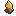

# 📿 Artifacts

The Crimson Forest is home to a wide range of early relics—most ranked **F** or **E**—but don’t let their low rank fool you. These artifacts carry the memories of long-forgotten warriors, beasts, and kings.\
This area also introduces the game's **first artifact set**: the **Legend Set**.&#x20;

###  Resource Drops

While traversing the Weeping Valley, you’ll find these items:

*  <mark style="color:blue;">**Shield Repair Scrolls**</mark>

***

####  Blade Targe

A back plate which has taken many arrows during battles in the Sky, \
\
.png>)

* **Set Piece:** Legend Set (1/3)
* **Drop:** Dropped by **Hronk The Glutton**&#x20;

> Some say it once belonged to a warrior who never lost, even in death.

***

#### &#x20; Legend Robe

A torn yet regal robe, faded by time and stained by battles fought long ago. Despite its age, it fits like it was meant for a true legend.\
\
.png>)

* **Set Piece:** Legend Set (2/3)
* **Drop:** Dropped by a **Zoglin** deep in the heart of the Crimson Forest.

> It shouldered the weight of a Legend.

***

####  Crown of Pig

A delicate, battle-worn crown. It’s not made of gold or jewels—but of conviction, memory, and sacrifice. Light as air, yet it carries the weight of a kingdom.\
\
.png>)

* **Set Piece:** Legend Set (3/3)
* **Reward:** Obtained by completing the **Magnus Side Quest**.

> Its former wearer was known for his laughter, skill, and indomitable spirit—echoes of him still linger in the wind.

### 🧬 Legend Set Bonus

**(Activated when wearing all 3 pieces)**\
**Set Name:** _Legend Set_

* **Bonus:** +10 Max HP
* **Set Effect:** Strengthens the wearer’s body and soul, fueled by the undying spirit of a legend lost but never forgotten.

***

####  Relic of Crimson Rot

Applies constant Poison II to user if they don't have the right requirements to use the item.\
\
.png>)
