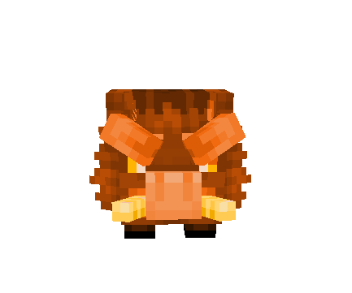
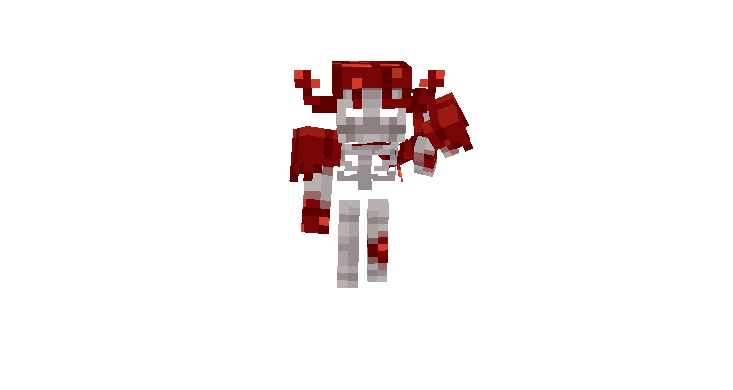
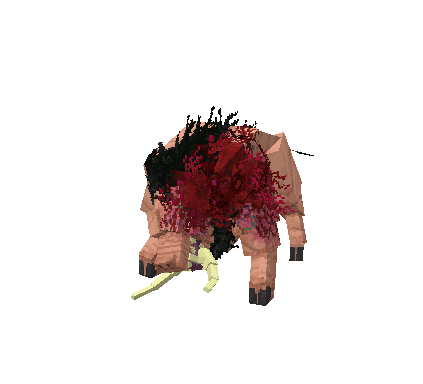
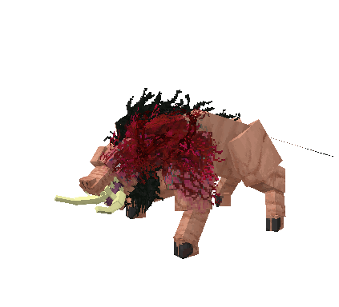

# ⚔️ Bosses

The Crimson Forest is a twisted realm where reality itself has been corrupted by the insidious red rot. This malevolent force spreads through every tree, every blade of grass, and every breath of air, mutating all souls and creatures unfortunate enough to be caught in its grasp. What was once a vibrant woodland has become a nightmarish landscape where the very essence of life is perverted and transformed into something dark and unrecognizable.

***

### Hronk the Glutton

<figure><figcaption></figcaption></figure>

**Base HP:** 650 ❤️ (scales with player count like other mobs)

**Abilities:**

* **Chase and Crash:** Relentlessly pursues players before crashing into them, throwing them around the battlefield.

**Location:** Roams the area searching for anything to devour.

**Drops:**

*  **Blade Targe** - A legendary backplate.

📖 **Lore: The Endless Hunger**

> Hronk was once a modest farmer who fell victim to a cursed artifact that twisted his very essence. Now an insatiable beast, he devours everything in his path, forever seeking to fill the void that can never be satisfied.

###  Drops Info

<figure><figcaption></figcaption></figure>

***

### The Crimson Giant

<figure><figcaption></figcaption></figure>

**Base HP:** 950 ❤️ (scales with player count like other mobs)

**Abilities:**

* **Crimson Whip:**  Whips players inflicting poison and causing great damage.
* **Crimson Spin:** Spins in a rage and fury doing area damage to all players in it's path.

**Location:** Follow the left path to the Crimson Hill.

**Drops:**

* **Crimson Rotting Artifact** - A corrupted relic pulsing with dark energy and decay.

📖 **Lore: The Fallen Warrior**

> Once among the mightiest warriors of the realm, this giant lost its soul in the fires of Ignis. Now a hollow shell animated by Crimson Rot, it continues its eternal march, forever seeking the soul it can never reclaim.

###  Drops Info

<figure><figcaption></figcaption></figure>

***

### Velgorn&#x20;

<figure><figcaption></figcaption></figure>

**Base HP:** 2000 ❤️ (scales with player count like other mobs)

**Abilities:**

* **Charging Stampede:** When running, the ground trembles beneath his hooves as he relentlessly chases players to crash into them.\
  .gif>)\

* **Gore Attack:** Strikes with his massive horns, dealing heavy piercing damage to those caught in front.\
  It also can cast crimson curse during this time which follows and attacks the player.\
  
* **Defensive Kick:** If players attempt to flank him from behind, he delivers a powerful backward kick to send them flying.\
  

**Location:** Patrols his domain, the cursed keeper of this corrupted realm.

**Drops:**

* **Velgorn's Soul** - Can be traded for a powerful cleaver weapon.

📖 **Lore: The Cursed Keeper**

> Velgorn was once a noble and kind soul, beloved by all who knew him. The Crimson Rot's corruption twisted his pure heart into something dark and tormented. Now he walks these cursed grounds each day, hoping against hope that someone might free him from his eternal curse.

###  Drops Info

The crimson clever is one of a kind weapon, forged from the Crimson rot and a creatures giants soul.

<figure><figcaption></figcaption></figure>

<figure><figcaption></figcaption></figure>
