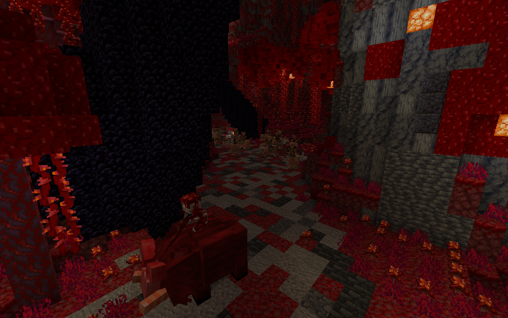
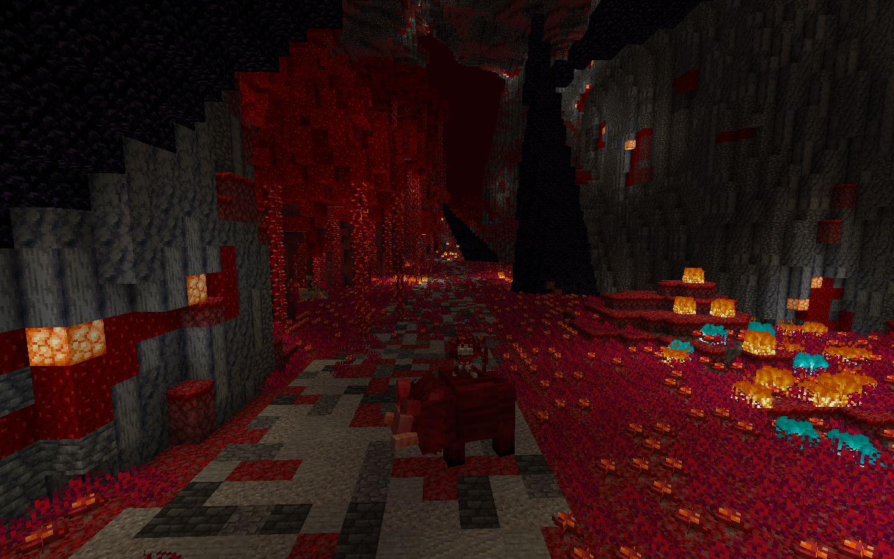
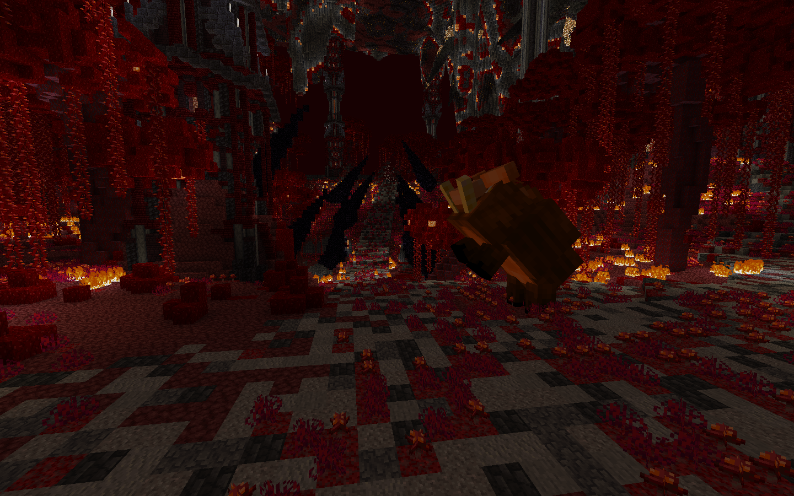
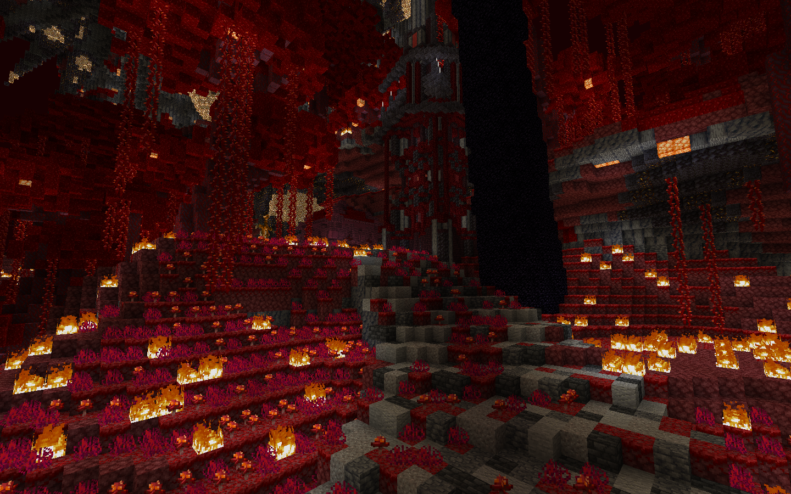
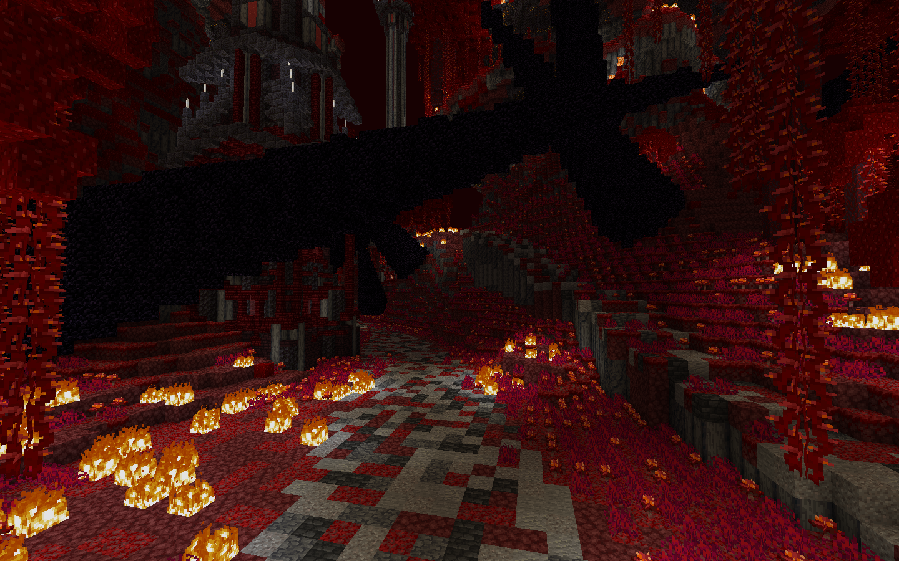

# 📶 Progression

***

### 🍂 The Crimson Forest

The **Crimson Forest** unlocks after clearing the **Weeping Valley**. It is a deep-rooted, red-hued jungle twisted by corruption and filled with both opportunity and danger

The forest is divided into **two branching paths** that eventually **converge in the center**, allowing players to choose their preferred route forward:

***

#### 🧭 Path Structure

* **Left Path (Perilous Route):**\
  Overgrown and hostile, this route contains a high density of mobs and encounters. While more dangerous, it rewards players with **greater loot and unique drops**.\

<figure><figcaption></figcaption></figure>

*   **Right Path (Safer Trail):**\
    A more navigable and straightforward crossing, with fewer enemies but also fewer rewards. Ideal for those who prefer a faster or safer progression.\

    <figure><figcaption></figcaption></figure>

*   **Central Convergence:**\
    Both routes meet in the heart of the forest, where players will encounter **Hronk the Glutton**, the first **mini-boss** of the area. Defeating him is required to move forward.\

    <figure><figcaption></figcaption></figure>

***

#### 🚦 Path Choices After Hronk

Once Hronk is defeated, players must make one of three choices:

* **Go Straight:**\
  Head directly toward the **main boss**, through a corrupted inner grove where the forest grows increasingly unstable. **Velgorn** awaits.

<figure><figcaption></figcaption></figure>

* **Go Right:**\
  Take a detour toward **Zolos’s side quest**, which leads through the **Scorpion Cave**—a mysterious sub-area filled with venomous creatures and buried secrets.

<figure><figcaption></figcaption></figure>

* **Go Left:**\
  Venture toward the lair of the **Crimson Giant**, a powerful optional boss with deep connections to the forest’s origins and unique rewards.

<figure><figcaption></figcaption></figure>

***

### 🚪 What's Next 

Defeating the final boss of the Crimson Forest, **Velgorn**, will purify the region’s heart and unlock the next major destination: **The Warped Islands** — a surreal archipelago of shattered terrain and raw, unstable magic.\

***
