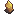

# 📿 Artifacts

The **Crimson Rotten Mine** may be a brutal introduction to Ignis, but for those who explore thoroughly and face its dangers head-on, it offers powerful rewards.

###  Resource Drops

While traversing the mine, you’ll find that **many mobs drop essential survival items**:

*  <mark style="color:red;">**Lesser Health Potions**</mark>
*  <mark style="color:blue;">**Shield Repair Scrolls**</mark>
*  <mark style="color:purple;">**Armor Repair Scrolls**</mark>

These are much more common in this area than in later zones, where such resources become scarce. We strongly encourage players to **slay every mob** they encounter — not just for quest progression, but to stockpile these critical items for the trials ahead.

***

###  Unique Artifacts

Hidden within the depths of the mine are **three F ranked artifacts**. Each offers a passive stat bonus, and all are **exclusive to this zone**. You won’t find them again elsewhere — so don’t leave the mine empty-handed.

| Artifact Name                                                           | Effect                                                                                                    | Dropped By         |
| ----------------------------------------------------------------------- | --------------------------------------------------------------------------------------------------------- | ------------------ |
|  **Rusty Underpiece**  |  +1 Defense                                                      | a Crimson Rat      |
|  **Crimson Rat's Tooth**   |  <mark style="color:yellow;">+1 Strength</mark>                 | a Crimson Rat      |
|  **Crimson Basilisk Eye** | .png>) <mark style="color:blue;">+1 Mana Core Level</mark>  | a Crimson Basilisk |

> 🔍 **Note:** We’ve _intentionally_ left out the exact drop locations and mob placements for each artifact. Part of the fun in Ignis is discovery — pay attention to your loot and stay observant!

