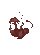
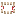

# ⚔️ Bosses

### 💀 Area Boss: The Hydra

The final trial of the **Crimson Rotten Mine** is a horrific abomination a creature older than the mine itself. Prepare carefully. The Hydra is not just a test of strength, but of survival, awareness, and teamwork.\

<figure><figcaption></figcaption></figure>

***

#### 📖 Lore: The Sealed One

> Deep beneath the rotting tunnels lies a creature **long forgotten**, its soul corroded by centuries of torment and hate.\
> Once a guardian of flame, the **Hydra** was corrupted by the crimson rot that infected the mines.\
> Its flesh is dead. Its soul barely flickers. Yet **sheer evil keeps it alive**, burning deep within its hollow hearts.\
> **Sealed away** in the lowest chamber, it now stirs waiting, watching, whispering.

***

#### 🧠 Boss Stats

| Attribute           | Value                                  |
| ------------------- | -------------------------------------- |
| **Name**            | Hydra                                  |
| **Total HP**        | ❤️ 1500 _(+1500 per player)_           |
| **Phase Mechanics** | Multi-Headed – loses heads as HP drops |
| **Drop Item**       | _Rotten Hydra Soul_ 🜸                 |

## 🐉 Hydra Abilities

### 🔥 Flame Breath

A wide-cone **AoE breath attack** that deals **near-instant fatal damage** to anyone caught in its path. It’s heavily telegraphed — dodge it or die.

<figure><figcaption></figcaption></figure>

***

### 🪨 Stomp

The Hydra stomps the ground, causing **basalt spikes** to erupt from the earth, tracking the **nearest player**. These spikes deal heavy damage and can interrupt movement.\

<figure><figcaption></figcaption></figure>

***

### 🐲 Bite

A **melee-range attack** from any of the Hydra’s front heads. Often targets multiple players if grouped too closely.

<figure><figcaption></figcaption></figure>

***

### 🦴 Tail Swipe

If you get too close to the Hydra’s rear, its massive tail lashes out, **knocking players back** with high force. Use distance or timing to avoid.

<figure><figcaption></figcaption></figure>

***

#### 🧠 Multi-Head Mechanic

The Hydra begins the fight with **multiple heads**, and **each head has its own unique attack behavior**:

* One head might cast **Flame Breath**
* Another performs **Stomp**
* A third could **Bite**

As the Hydra **loses HP**, it also **loses heads**, reducing the number of attacks it can perform. However, its behavior becomes more **desperate** and **unpredictable** as it nears death.

***

### Rotten Hydra Soul: Trade Options

Upon defeating the Hydra, it will drop a **Rotten Hydra Soul** — a corrupted item filled with residual energy. You can exchange this soul for one of the following powerful items. The <mark style="color:red;">Health Crystal</mark> boosts overall :heart: <mark style="color:red;">by 5</mark>.

<figure><figcaption></figcaption></figure>

<figure><figcaption></figcaption></figure>

###  <mark style="color:red;">Life Steal</mark>

Percentage of damage you gain back as health while dealing melee damage.
