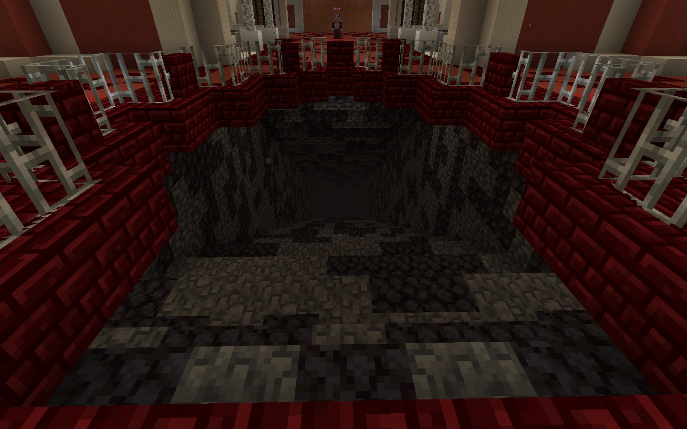

# 📶 Progression

#### 🔥 Enter the Crimson Rotten Mine

Your journey begins in **Ignis**, a land scarred by fire and fortune. The **Crimson Rotten Mine** is the first zone you'll explore — a dark, dangerous pit brimming with hostile mobs, hidden loot, and the precious **Iridium Ore** needed for your survival.

After accepting your first quest from **Sara**, head down the creaking staircase into the mine below. There, your objective is clear:

<figure><figcaption></figcaption></figure>

> 🎯 **Defeat mobs**, gather **Iridium**, and complete the **Progression Quest** to move forward in your adventure.

***

### .png>) Iridium Ore

The backbone of early survival in Ignis, **Iridium Ore** is scattered throughout the mine. Don’t worry about missing it — **nodes respawn every 90 seconds**, giving you plenty of chances to collect what you need.

📌 **Tip:** Iridium glows faintly in the dark. Keep an eye on cave walls and corners — you’ll often find clusters near dead-end tunnels or guarded by tougher enemies.

***

### 💥 Loot & Combat Tips

Enemies in this area aren’t just here to slow you down — they drop essential early-game loot. Expect to find:

* 🛡️ **Armor & Shield Repair Scrolls**
* ❤️ **Health Potions**

We highly recommend going on a **mob-clearing spree** to farm these items early. They’ll give you the edge you need for what's coming next.

> 💡 **Pro Tip:** Pull groups carefully and watch your corners — some mobs here patrol in small squads and can overwhelm unprepared adventurers.

***

### 🚪 What’s Next?

Once you’ve cleared enough enemies and mined enough Iridium, return to **Sara** to complete the quest and unlock access to the next region. The real test begins beyond the mine...

<figure><figcaption></figcaption></figure>

***
