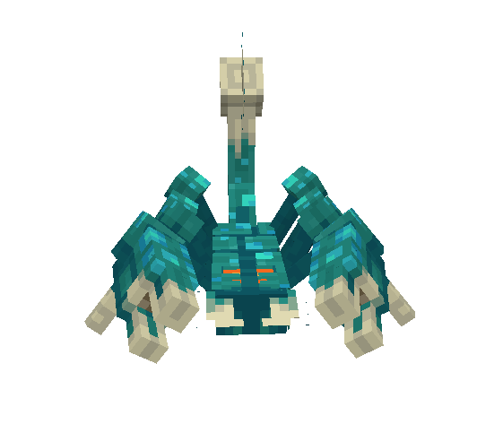
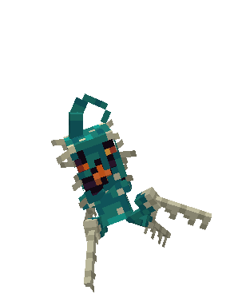
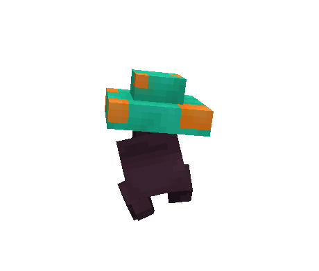
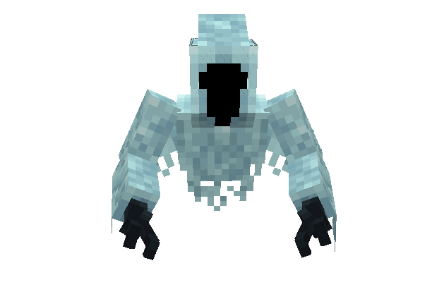
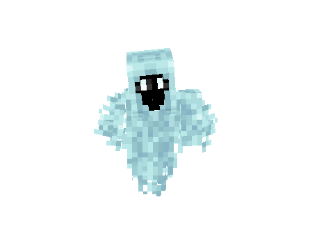

# 👹 Area Creatures

**Warped Scorpions**

Twisted by the islands' raw, unstable magic, these corrupted scorpions roam the lands with their tainted presence.

* **Base HP:** 180 ❤️ (+?? per additional player nearby – _HP scales with player count in the area_)
* **Abilities:**
  * **Warped Pinch:** A deadly claw attack that deals hefty damage.&#x20;
  * **Toxic Sting:** A swift strike inflicting blindness and nausea.
  * ⚠️ **Warning:** Warped Scorpions move erratically. Keep a distance or attack quickly before they land the first strike.&#x20;

<figure><figcaption></figcaption></figure>

**Warped Creepers**

Swift and nimble, Warped Creepers hunger with explosive intent to destroy anything that crosses their path.&#x20;

* **Base HP:** 90 ❤️ (+?? per additional player nearby – _HP scales with player count in the area_)
* **Abilities:**
  * **Warped Detonation:** Releases a lethal explosion that often results in an instant death.
  * ⚠️ **Warning:** Warped Creepers move fast and can easily ambush players from ceilings or ledges.&#x20;

<figure><figcaption></figcaption></figure>

**Baby Fungi**

Animated by unstable magic, these mushrooms emerge from the islands' fungal overgrowth, ready to unleash poisonous toxins at any moment.

* **Base HP:** 20 ❤️ (+?? per additional player nearby – _HP scales with player count in the area_)
* **Abilities:**
  * **Spore Toxins:** Releases a toxic cloud that inflicts poison.
  * ⚠️ **Warning:** While weak alone, Baby Fungi can quickly overwhelm players when clustered.

<figure><figcaption></figcaption></figure>

**Wraiths**

The vengeful spirits of the Warped Islands. Wraiths are condemned souls, cursed to drift aimlessly throughout the islands, driven by despair.

* **Base HP:** 200 ❤️ (+?? per additional player nearby – _HP scales with player count in the area_)
* **Abilities:**
  * **Soul Slash:** Attacks the player with a melee slash imbued with soul-fire magic.
  * ⚠️ **Warning:** As specters of the air, watch out for wraith attacks while fighting ground level creatures.&#x20;

<figure><figcaption></figcaption></figure>

**Screaming Wraiths**

A more tormented form of the regular wraith, these shadows of the past scream out in agony as pleas to relinquish them from their misery.

* **Base HP:** 200 ❤️ (+?? per additional player nearby – _HP scales with player count in the area_)
* **Abilities:**
  * **Soul Slash:** Attacks the player with a melee slash imbued with soul-fire magic.
  * **Vengeful Scream: Emits a petrifying cry that attacks the player.**
  * ⚠️ **Warning:** Be prepared to dodge or block shriek attacks from Screaming Wraiths.\

<figure><figcaption></figcaption></figure>

**🧠 Strategy Tips**

* **Bring a Bow:** Pick off Warped Creepers with a bow before engaging with grouped-up mobs.
* **Stay Vigilant:** Unsuspecting mobs can ambush you at any time, especially from above.&#x20;
