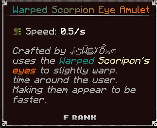

# 📿 Artifacts

***

####  Unique Artifacts 

 **Tough Fungi Core**\
Crafted through binding fungi #1-9 in a crafting table, which are scattered throughout the Warped Islands from baby fungi. Used to craft a Tough Fungi Ring.\

 **Tough Fungi Ring**

Crafted with 4x Iridium ingots and 1 tough fungi core.

<figure><figcaption></figcaption></figure>

 **Warped Scorpion Eye Amulet**

Dropped from Warped Scorpions.

<figure><figcaption></figcaption></figure>
