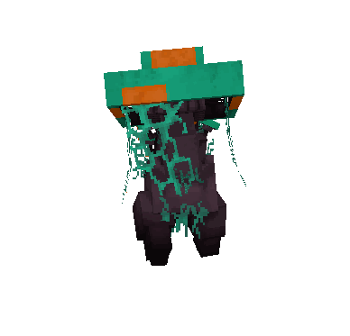
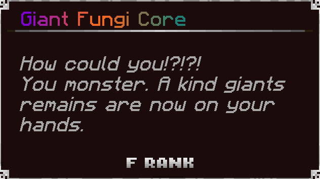
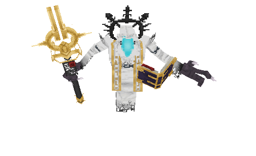
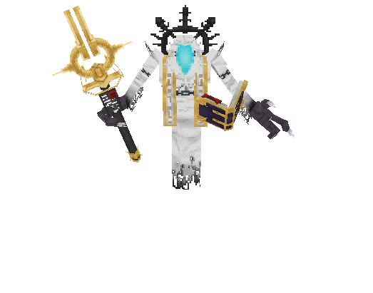
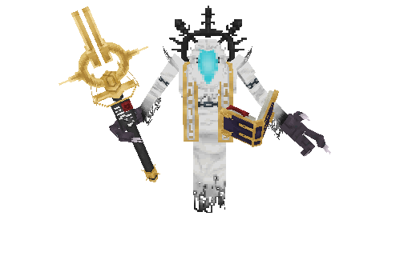
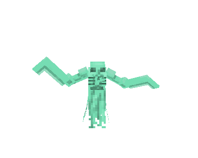
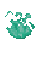
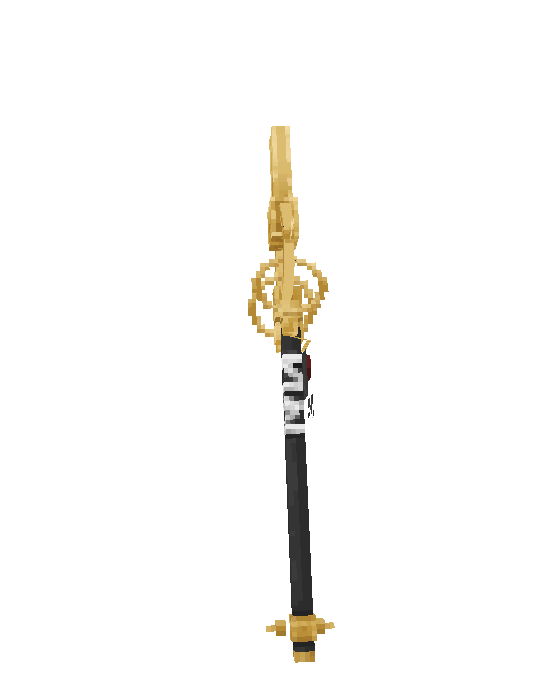
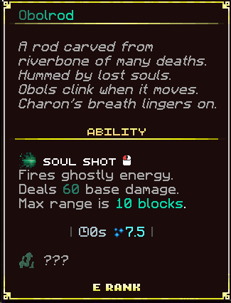

# ⚔️ Bosses

The **Warped Islands** are a realm consumed by powerful, unstable magic. The islands' foes reflect the sinister nature of this ancient power. Transformed by the islands' corruption, the bosses of this area command overwhelming strength.

***

## :mushroom: Giant Fungi, the Gentle Keeper  <a href="#thanatos-the-forsaken-choir" id="thanatos-the-forsaken-choir"></a>

A mushroom guardian born from centuries of warped fungal growth. As the kind protector of the fungi colony, it uses its superior size and watchful nature to ward off any unwelcome threats.



* **Base HP:** 1250 ❤️ (+1250 per additional player – _HP scales with party size_)
* **Abilities:**
  * **Head Smash:** Slams the player with its forceful mushroom cap, causing the player to leap back from the impact.
  * **Mushroom Growth:** The fungi releases a wave of toxic poison from its spores.&#x20;
  * **Fungal Charge:** The fungus barrels itself towards the player in a brutal charge, resulting in bone-crushing damage that sends the player flying back.&#x20;
* **Location:** On the right path, hidden within the Fungal Cavern.&#x20;
* **Drops:**
  *  **Giant Fungi Core**

**📖 Lore: Giant Fungi**

> What few know is that beneath it lies a mycelial intelligence, older than even the Piglins’ ancient texts. That mind is the Giant Fungi—a towering, gentle creature born from centuries of quiet fungal growth.
>
> Unlike most Ignis creatures, the Giant Fungi is not violent by nature. It grew slowly beneath the warped Nylium, absorbing Warped energy, feeding off ambient heat and soul residue. Over centuries, it awakened—not as a beast, but as a caretaker.

####  Drops Info <a href="#drops-info" id="drops-info"></a>

Drops a Giant Fungi Core that boosts HP by 3 hearts when consumed.



***

## :man\_mage: Charon, the Cursed Scholar <a href="#mrox-and-grox-the-twin-howls" id="mrox-and-grox-the-twin-howls"></a>

Once a mortal archivist, Charon stands bound to the Cathedral of Veil, his soul eternally chained in pursuit of immortality.

<figure><figcaption></figcaption></figure>

* **Base HP:** 2500 ❤️ each (+2500 per additional player – _HP scales with party size_)
* **Abilities:**
  * **Wrath of Obolrod:** A crushing strike from the Obolrod staff, the staff's cursed energy knocks the player back while dealing immense damage.

<figure><figcaption></figcaption></figure>

* **Grimoire Clash**: Charon throws his ancient grimoire at the player, unleashing a blast of corrupted energy on impact.

<figure><figcaption></figcaption></figure>

* **Soulfire Casts:** Charon casts different spells based on soul fire magic.
* **Hollow Blast:** Sends a streak of soulfire magic to the player, dealing damage.
* **Levitation Beam**: Sends a black beam of soulfire magic that levitates the player on hit.
* **Phantom Blades**: Blades materialized from soulfire strike the player with relentless precision.&#x20;
* **Spectral Storm**: A swarm of minions created from soulfire that attack the player.\
  \


<div align="left"><figure><figcaption></figcaption></figure> <figure><figcaption></figcaption></figure></div>

<figure><figcaption></figcaption></figure>

* **Location:** On the left path, the **Cathedral of Veil.**
* **Drops:**
  *  **Charon's Soul** – Can be traded at the Snail Trader for the **Obolrod** staff.

**📖 Lore: Charon**

> Long ago, Charon was a human—an archivist and soul scholar, driven by a fear of death and a hunger for knowledge. He discovered the Cathedral during an excavation of ancient ruins, and once inside, he never returned.
>
> Or rather—his body never returned.
>
> Inside, he found the Veil Scripts, an ancient language capable of separating body and soul, allowing a person to escape death... but at a cost. Eager to understand it, he bound his soul to the cathedral, hoping to find a way to return to flesh once he fully deciphered the code.
>
> But the longer he stayed, the more the cathedral fed on his humanity, twisting his body into a giant wraith-like form—a shadowy, skeletal figure cloaked in white spell-cloth, with glowing runes etched into his bone.
>
> Now, centuries later, he remains... obsessed, nearly mindless, yet still whispering the same phrase over and over in ancient tongue:
>
> ```
> "I am not yet lost..."
> ```

####  Drops Info <a href="#drops-info-1" id="drops-info-1"></a>

Charon drops the **Obolrod** — a staff forged from forbidden knowledge and cursed soulfire.

<figure><figcaption></figcaption></figure>

<figure><figcaption></figcaption></figure>
