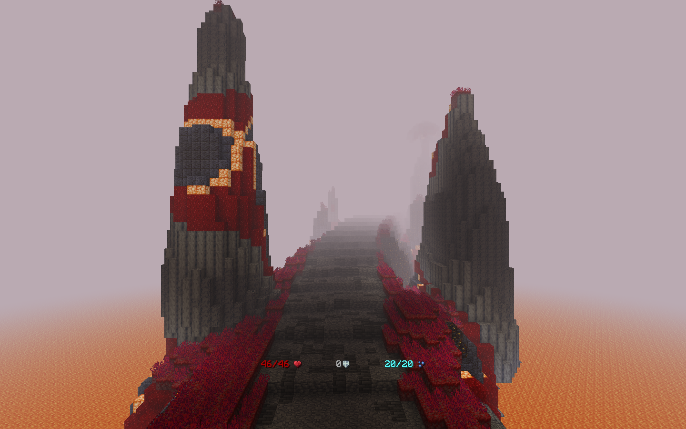
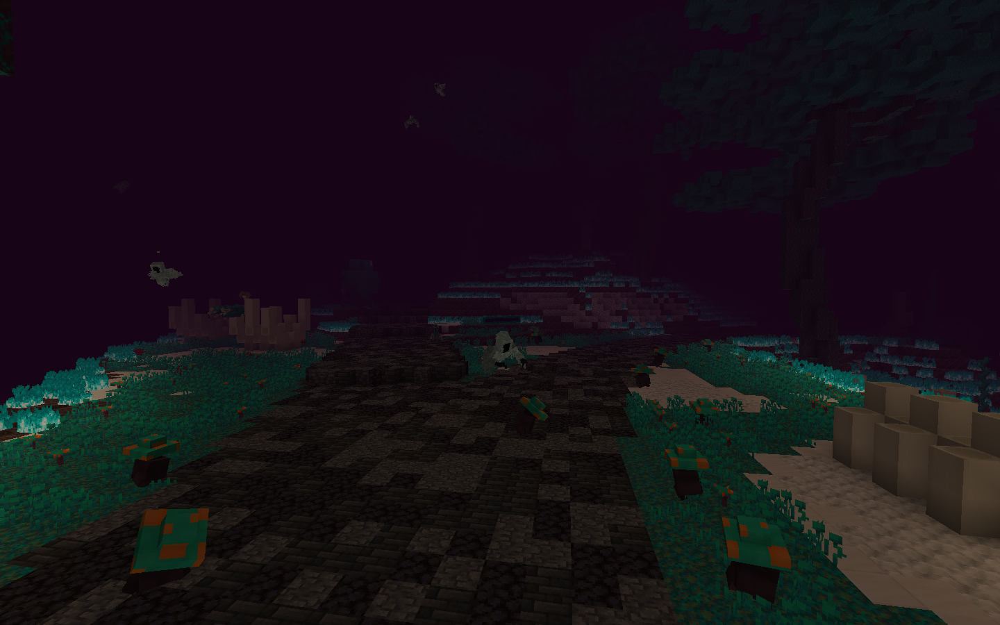
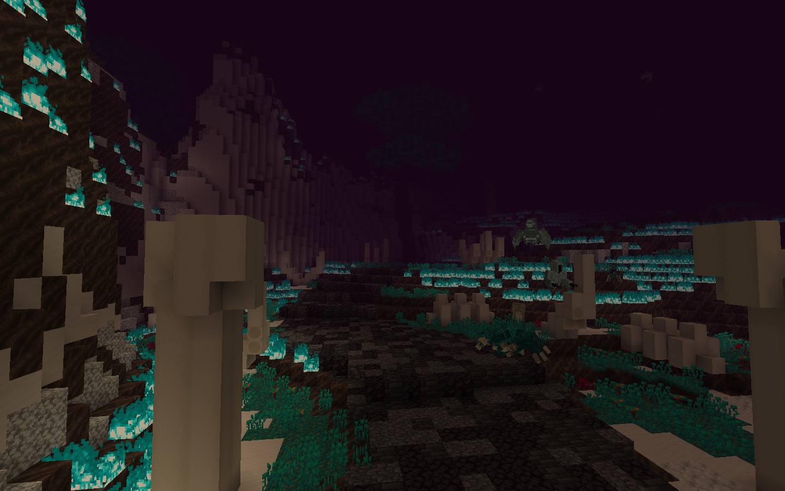
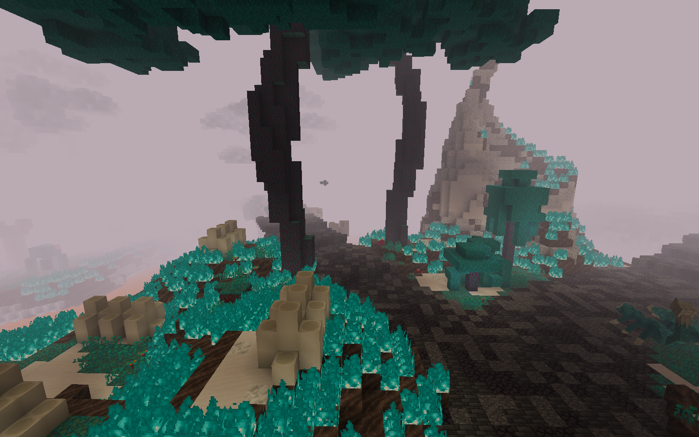
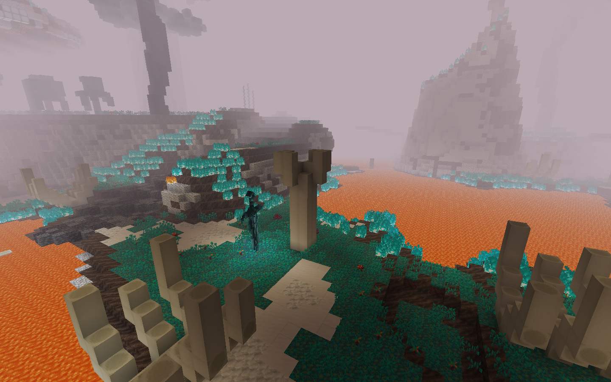
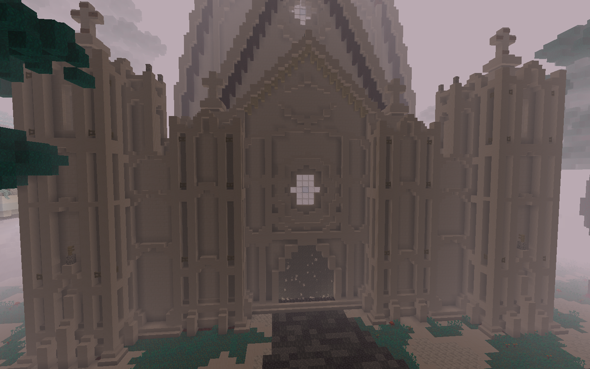
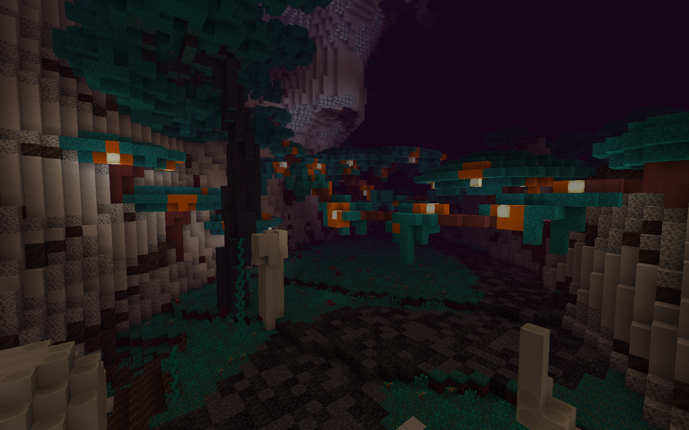

# 📶 Progression

## :blueberries: **The Warped Islands** 

Unlocked after clearing the **Crimson Forest**, the **Warped Islands** is an unforgiving and bleak landscape, corrupted over time by ancient magic. Behind the echoes of the fallen and the islands' twisted creatures lies a land engulfed by Charon's madness.\
\
Cross the bridge to enter the main road. The main road splits into two paths, each having its own obstacles.

<figure><figcaption></figcaption></figure>

<figure><figcaption></figcaption></figure>

***

## **🧭 Path Structure**

*   **Left Path:** Once a vibrant forest, this landscape remains scorched by violent soul fires and became overtaken by warped magic. Scattered across this fungi-laced path are remnants of the islands' former inhabitants — those who could not withstand the islands' raw power. Wraiths, creepers, scorpions, and fungi haunt this path to the Cathedral of Veil, where Charon's soul is chained for eternity.\

    <figure><figcaption></figcaption></figure>
* This path splits here: on the left, a shattered bridge stretches to mysterious areas of the Warped Islands just beyond the player's reach. The right continues onward to the Cathedral of Veil, where cunning dangers grow more frequent.

<figure><figcaption></figcaption></figure>

* The right path continues, eventually leading to a small molten island surrounded by fiery lava. Beyond the path lies the Cathedral of Veil, where travelers must parkour over a path of bones in order to enter the domain of Charon. &#x20;

<figure><figcaption></figcaption></figure>

* Here stands the **Cathedral of Veil**, a towering monument of ancient power. Within lies Charon, forever bound by his hunger for immortality.

<figure><figcaption></figcaption></figure>

*   **Right Path:** A shorter path, this overgrown trail teems with fungal lifeforms and leads to the Fungal Cavern. Within this cave lies the **Giant Fungi**, the gentle protector of fungal life.

    <figure><figcaption></figcaption></figure>

***

## 🚪 What's Next 

Defeating Charon, the final boss of the Warped Islands, will allow you to unlock the Infernal Dunes — a fiery hellscape that will lead you to the final chapter of Ignis.
