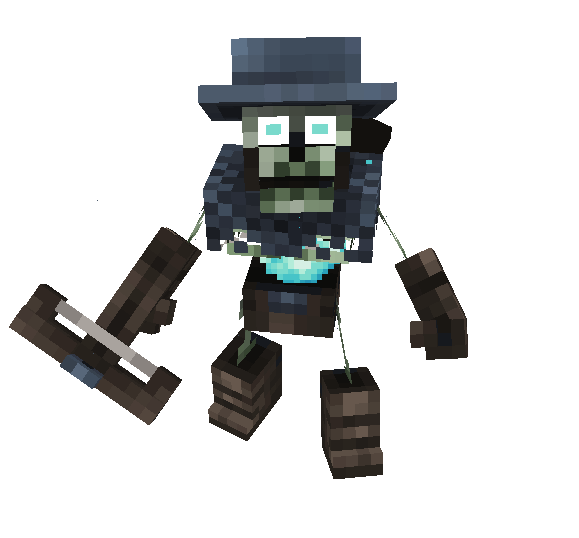
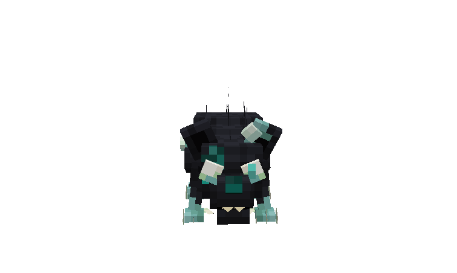
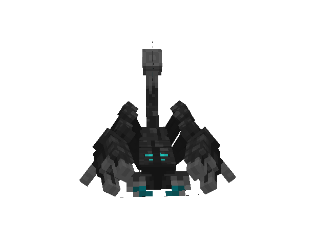

# 👹 Area Creatures

The **Weeping Valley** is haunted by four distinct enemy types: the **Undead Archers**, **Withered Rats**, **Soul Scorpions**, and **Demon Dogs**. Each of them brings a deadly mechanic or ability that can overwhelm unprepared adventurers. Awareness and positioning are key to surviving this corrupted graveyard of a battlefield.

***

#### Undead Archer

Once proud sentinels of a fallen kingdom, **Undead Archers** now aimlessly guard the valley’s ridges and ruins. Their half-broken crossbows rattle as they draw, and their empty sockets track the living with eerie precision.

* **Base HP:** 110 ❤️ (+100 per additional player nearby – _HP scales with player count in the area_)
* **Abilities:**
  * **Rusted Shot:** Fires a corroded arrow that deals moderate piercing damage.
  * **Rotten Lunge:** When approached, the archer drops its bow and swings its jagged arm bone in a wide arc.
  *   ⚠️ **Warning:** Even without their weapon, they are not helpless. Getting too close may provoke a dangerous counterattack.\
      \

      <figure><figcaption></figcaption></figure>

      > **Lore:** These archers once served in the Royal Guard of a forgotten empire, sworn to defend the kingdom to their last breath—and beyond. Now they stand sentry not out of duty, but out of curse, guarding broken walls long since conquered. Their aim may falter, but their hatred never does.

***

#### Soui Rat

Scavengers of both the living and the dead, **Withered Rats** are grotesque, diseased kin of the Crimson Rats. Swarming in packs, they thrive in the decay of the Weeping Valley.

* **Base HP:** 60 ❤️ (+20 per additional player in combat)
* **Abilities:**
  * **Leap:** A short-range jump to close distance. Can knock players off balance.
  * **Bite Attack:** Quick, snapping strikes that can interrupt spellcasting or light attacks.

> These rodents may seem minor, but in numbers, they become a serious threat in confined areas.

<figure><figcaption></figcaption></figure>

> **Lore:** Once nothing more than common vermin, the Soui Rats have been twisted by disease, dark magic, and necrotic decay. Some say the first of their kind gnawed on the remains of a forgotten god. Now they breed endlessly beneath the valley, thriving in corruption, and always hungry.

***

#### Demon Dog

The cursed hounds of the valley, **Demon Dogs** are half-shadow, half-beast, shaped by the valley’s lingering hatred. Their eyes glow with ember-red hunger, and their howls echo across the mist.

* **Base HP:** 110 ❤️ (+100 per additional player nearby)
* **Abilities:**
  * **Pounce:** A high-speed leap that can knock back and stagger.
  * **Feral Bite:** A savage bite that causes bleeding over time.
  * **Evasive Retreat:** If surrounded or struck hard, the dog will leap backward to reposition.

> These beasts prefer to control the flow of combat—don’t let them.

<figure><figcaption></figcaption></figure>

***

#### Soul Scorpion

Shrouded in ghostly energy, **Soul Scorpions** are spirits bound to monstrous forms. Their translucent exoskeletons pulse with the essence of the damned.

* **Base HP:** 160 ❤️ (+100 per additional player in combat)
* **Abilities:**
  * **Claw Pinch:** A powerful grab that slows player movement and interrupts abilities.
  * **Spectral Stinger:** Inflicts **Wither** for 3 seconds – heavy damage over time and reduced healing received.

⚠️ **Warning:** Engage carefully. Soul Scorpions can chain their attacks, locking down unsuspecting players with deadly effect.

> **Lore:** Demon Dogs are born from centuries of suffering. Once hunting companions of ancient warlords, they were cursed to remain in shadow when their masters slaughtered innocents to extend their reign. Now they prowl as revenants of wrath, their forms warped by the hatred still festering in the soil.

<figure><figcaption></figcaption></figure>

***

These enemies are a serious threat when combined. Stay alert, use terrain to your advantage, and don’t rush through the Weeping Valley unprepared!

> **Lore:** Soul Scorpions weren’t always monsters. Legends tell of executioners who took pleasure in dragging the guilty—and the innocent—into the sands to be buried alive. When their crimes were finally punished, their souls refused to pass on. Now, in spectral form, they drag others into suffering as they once did in life. Their stingers whisper names, and some swear they hear their own.
