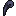
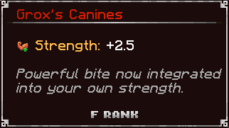

# 📿 Artifacts

The **Weeping Valley** is a melancholic  dead place yet the artifact it carried have a sort of an energy to them...

###  Resource Drops

While traversing the Weeping Valley, you’ll find these items:

*  <mark style="color:blue;">**Shield Repair Scrolls**</mark>
*  <mark style="color:purple;">**Armor Repair Scrolls**</mark>

***

###  Unique Artifacts

The **Weeping Valley** is rich in cursed history, and those brave enough to conquer its twisted inhabitants may uncover ancient relics—**Artifacts** that still pulse with the valley’s dark energy. These items are more than mere equipment; they are remnants of a forgotten era, each imbued with unique properties tied to the creatures that once wielded them.

####  Lucky Soul Rat Tail

It's a 0.01% drop from any Soul Rat in the Weeping Valley.\
\
.png>)

#### .png>) Soul Scorpion Amulet

Dropped by the Soul Scorpion Boss. Worn in the Amulet Slot\
\
.png>)

####  Silver Mana Ring

A Undead Archer in the Weeping Valley drops a Small Mana Core, it then can be combined with 4x Silver Ingots in a crafting table to craft this ring.\
\
.png>)

####  Mrox's Claw

Dropped by Mrox one of the Twin Howls, a demonic energy radiates from this item.\
\

####  **Grox's Canines**

Dropped by Grox one of the Twin Howls they're ready for ripping enemies apart\
\

#### .png>) **Mortuus Tomb**

A grimoire which holds a heavy destiny for the user. It is received by Trading Capra Demon's Soul for it.\
\

> 🔍 **Note:** We’ve _intentionally_ left out the exact drop locations and mob placements for each artifact. Part of the fun in Ignis is discovery — pay attention to your loot and stay observant!

