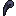

# ⚔️ Bosses

The **Weeping Valley** is not only home to cursed creatures, but also to tormented beings of immense power—bosses shaped by the valley’s grief and corruption. These encounters are meant to test your timing, awareness, and endurance. Each boss guards a powerful reward, but defeating them will also inch you closer to unraveling the valley’s grim legacy.

***

### 🪦 Thanatos, The Forsaken Choir

Once a temple guardian sworn to protect the souls of fallen warriors, **Thanatos** was twisted into a skeletal abomination by the very spirits he failed to protect. Now residing atop the **Scorpion Ridges**, he eternally screams their sorrow into the wind.\

<figure><figcaption></figcaption></figure>

* **Base HP:** 750 ❤️ (+600 per additional player – _HP scales with party size_)
* **Abilities:**
  *   **Soul Scream:** Emits a devastating burst of energy from his chest cavity. **Instantly fatal** if hit, but clearly telegraphed and easy to dodge with precise rhythm and spacing.

      > ⚠️ This attack is the core mechanic of the fight. Think of it as a rhythm game: time your jumps over shifting bone platforms and dodge the scream’s pulse.
  * **Hand of the Condemned:** A crushing forward slam that sends out shockwaves, capable of staggering and knocking players back. Can break bones and egos alike.
* **Location:** Top of the **Scorpion Ridges**.
* **Drops:**
  * .png>) **Soul Crescent Shield** _(details below)_
  * **Solaire Chest** – contains a hoard of coins and radiant light

#### 📖 Lore: The Judge

> &#x20;Thanatos was once the Valley’s sacred judge, his voice used to guide souls to peace. Now, corrupted by grief, he uses that same voice to tear them apart. His fall marked the beginning of the Weeping Valley’s descent into madness.

###  Drops Info&#x20;

The Soul Crescent Shield is a very useful item for the upcoming next two areas, solo play certified.\
\

<figure><figcaption></figcaption></figure>

<figure><figcaption></figcaption></figure>

***

### 🐺 Mrox and Grox, The Twin Howls

Born from the same corrupted bloodline as the Demon Dogs, **Mrox** and **Grox** grew far beyond the size of their kin. They now roam the **Skeletal Remains**, howling in unison and feeding on those foolish enough to wander into their den.

<figure><figcaption></figcaption></figure> <figure><figcaption></figcaption></figure>

* **Base HP:** 250 ❤️ each (+scales with player count like other mobs)
* **Abilities:**
  * **Grox:** Faster and more agile. Performs **Razor Leap** and **Rapid Bite** in quick succession.
  * **Mrox:** Heavier, but deals more burst damage. Executes **Bone Slam** and **Gore Charge**.
  * **Pack Assault:** When near each other, the twins unleash a **Combo Chain**—leap-bite from Mrox followed by Grox’s knockdown charge, which can pin players to terrain.
* **Location:** **Skeletal Remains**, a hollowed field of broken bones and shattered armor.
* **Drops:**
  *  **Mrox’s Claw** – a jagged talon imbued with demonic energy.
  *  **Grox’s Canines** – sharp fangs perfect for ripping meat apart
  * Each drops a small **Loot Chest** with coins and rare crafting materials.

#### 📖 Lore: Wandering Demon Dogs

> Legends say Mrox and Grox were once the personal hounds of the Capra Demon. After their master's sealing, they wandered the valley, feeding on fallen warriors until their own forms were warped by the souls they consumed.

### &#x20; Drops Info&#x20;

<figure><figcaption></figcaption></figure>

<figure><figcaption></figcaption></figure>

***

### 🪓 Capra Demon, Lord of Chains

The tyrant of the **Weeping Valley**, the **Capra Demon** is a towering brute wielding twin cleavers, forged from the broken souls of champions long dead. He binds their spirits with chain and iron, drawing strength from their eternal torment.\

<figure><figcaption></figcaption></figure>

* **Base HP:** 950 ❤️ (+600 per additional player)
* **Abilities:**
  * **Chains of Judgment (Combo):** A rhythmic 2-hit combo – _Left Cleave → Right Cleave_ **or** _Left Cleave → Right Cleave_. Getting caught in the full sequence is often fatal.\
    .gif>)
  *   **Singular Cleave Attacks** - Left or Right\

      
<figure><figcaption></figcaption></figure> <figure><figcaption></figcaption></figure>

  * **Double Slash -** Both Swords Used\
    
  * **Overhead Reckoning:** Slams both cleavers down in a brutal AoE attack, shattering shields and terrain alike.\
    \

  * **Soulbinding Leap:** Jumps high into the air, slamming down with spectral chains that tether players briefly, slowing movement and abilities.\
    .gif>)
* **Location:** The heart of the **Valley’s Abyss**, past the groaning gates of the forgotten arena.
* **Drops:**\
  **Soul of the Capra Demon** – Can be traded for the **Mortuus Tomb** artifact or used to **upgrade other boss weapons**.

#### 📖 Lore: Capra Demon

> Once a general of the old underworld, the Capra Demon betrayed death itself to claim power over the afterlife. His chains hold not just bodies—but regrets, failures, and memories. With every soul he binds, his own grows heavier. Slaying him releases the Valley’s trapped souls, and brings a glimmer of peace to the dead.

###  Drops Info

The Mortuus Tomb is a very special Artifact in the future it will be upgradable to an Emblem.\

<figure><figcaption></figcaption></figure>

<figure><figcaption></figcaption></figure>

***
