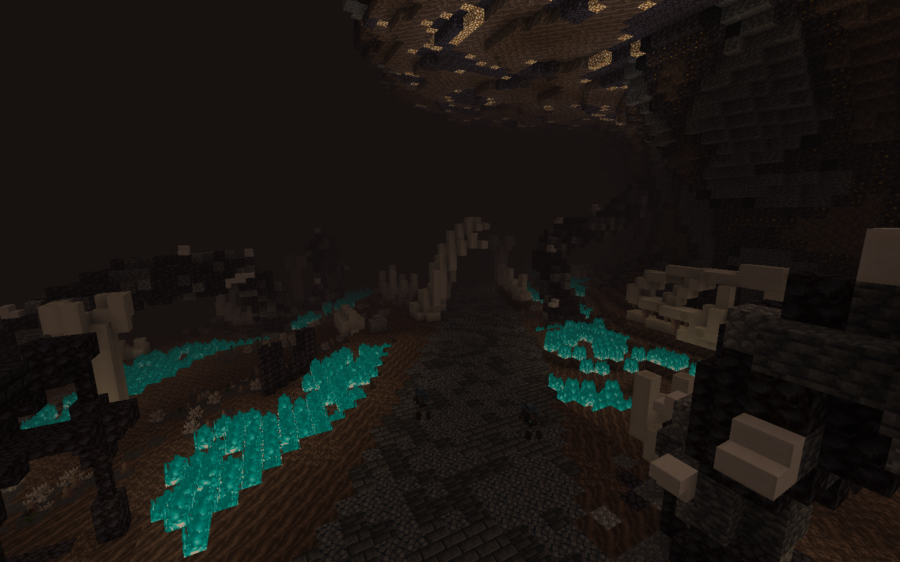
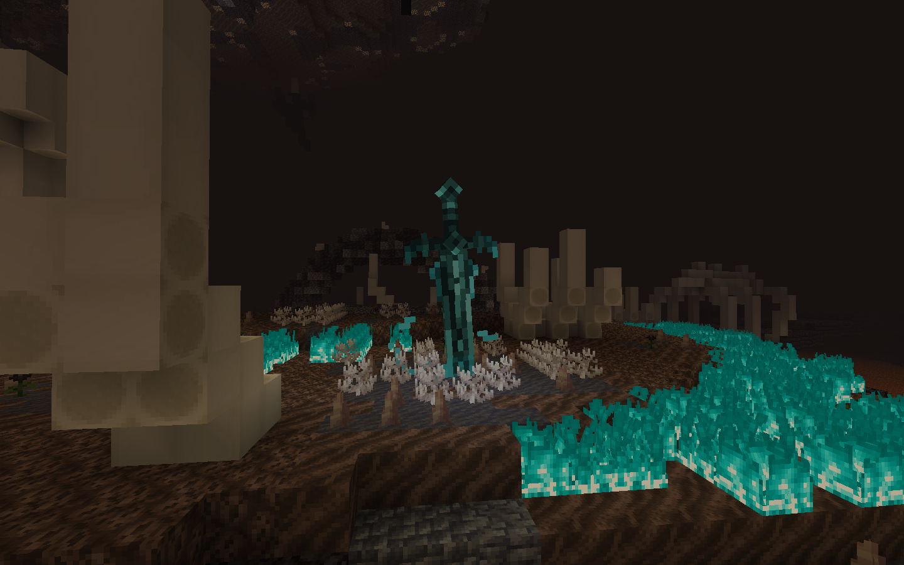
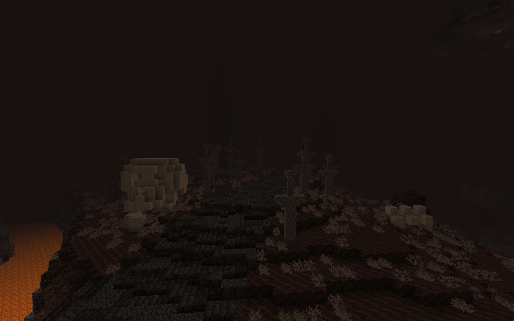
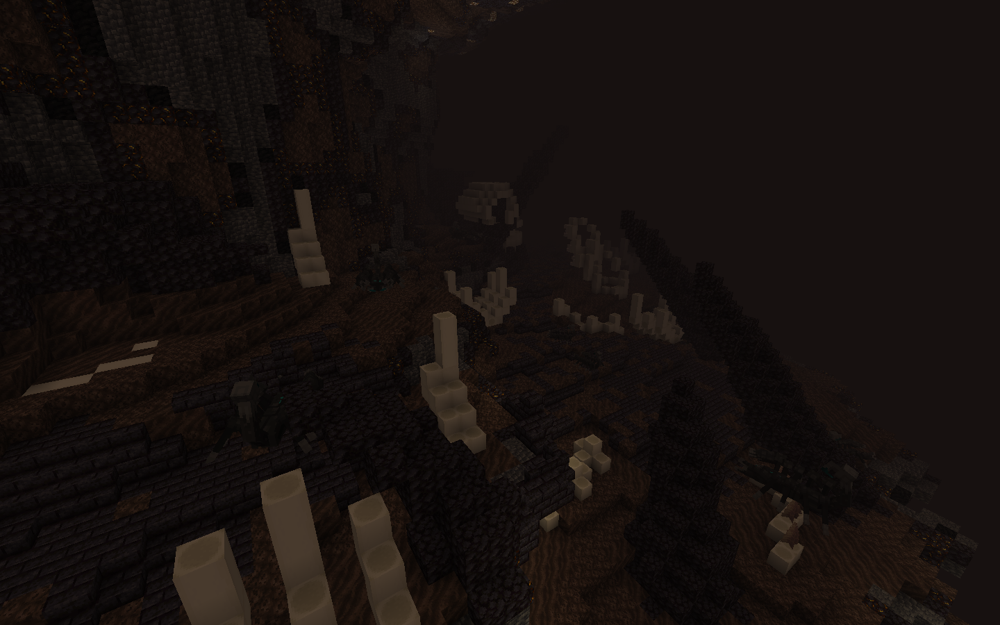
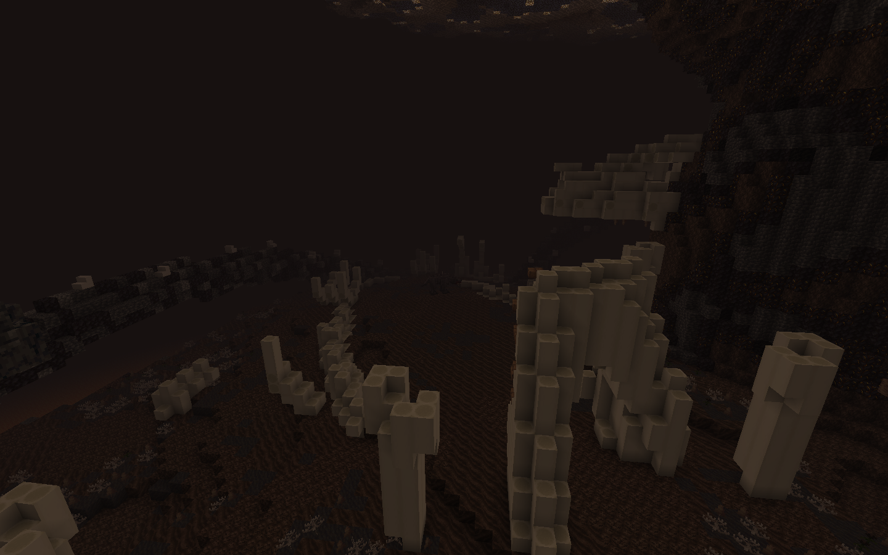
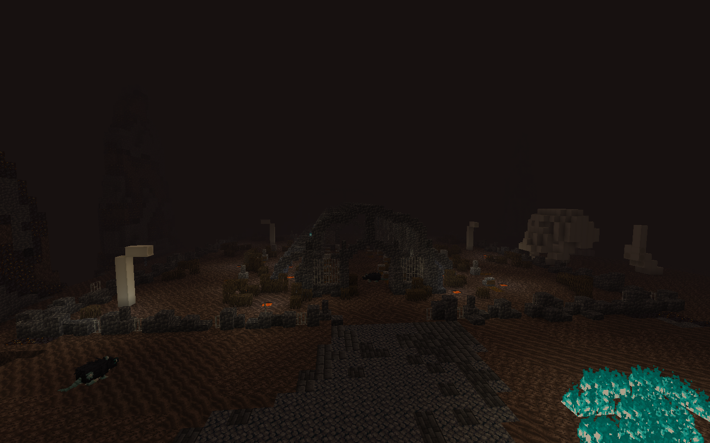
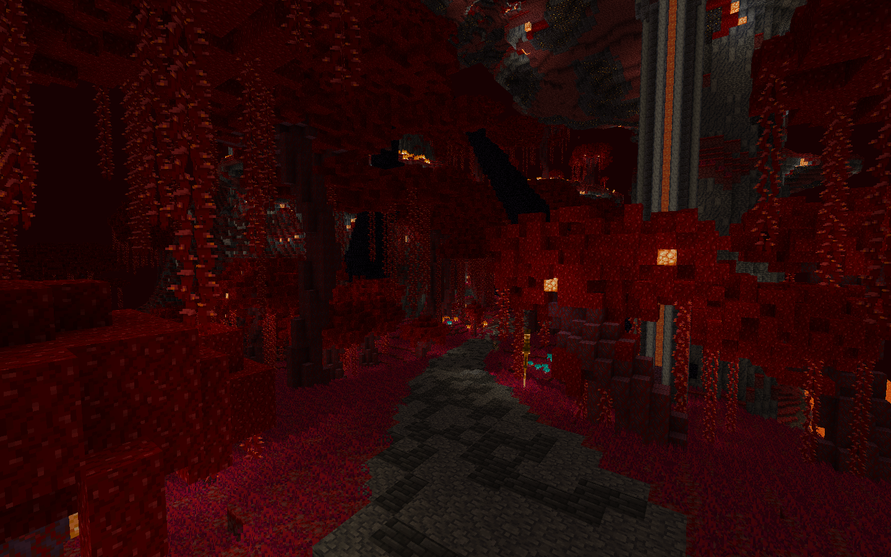

# 📶 Progression

## 🌫️ The Weeping Valley

Your next area after the Crimson Rotten Mine. Ensure full Iridium gear before entering.

### 📍 Location & Access

**Prerequisites:** Complete Crimson Rotten Mine **Required Gear:** Full Iridium armor set (head to toe) **Quest Requirement:** Accept next quest with Sara for progression tracking

**Path:** From the cathedral, go through the mist and head right to reach the Weeping Valley entrance.

### 🗺️ Area Layout

The Weeping Valley consists of multiple interconnected areas:

### Main Road

After the Soul parkour you're greeted with a couple of different mobs and your goal is to tread your path through them while slaying them to complete your quest.

<figure><figcaption></figcaption></figure>

Also don't forget to set your spawn point along the way with the Soul Wyrmfires. They're helpful!\

<figure><figcaption></figcaption></figure>

🌊 **Soul Canyon** - The primary path through the valley **Destination:** Leads to the Bone Graveyard for your final trial

<figure><figcaption></figcaption></figure>

### Side Areas

🦂 **Scorpion Ridges** - Access via ladders on the right of the first island&#x20;

<figure><figcaption></figcaption></figure>

💀 **Skeletal Remains** - Located on the left of the second island

<figure><figcaption></figcaption></figure>

### Final Destination

⚰️ **Bone Graveyard** - Where your journey along the path ends and you face your trial

<figure><figcaption></figcaption></figure>

### ⚡ Area Challenges

#### Initial Obstacles

**Parkour Section:** Navigate platforming challenges while under fire **Undead Archers:** Hostile ranged enemies throughout the parkour sequence **Path Progression:** Follow the main road, eliminate all encountered mobs

#### Primary Boss

🔥 **Capra Demon** - Area boss located at the end of the path\
**Significance:** Clearing this boss frees the dead from sorrow.

### 📖 Lore: The Weeping Valley

> The Weeping Valley serves as a resting place for dead vengeful spirits of warriors. The area overflows with grief, sorrow, and unfulfilled dreams.
>
> Nightmares plague the region, induced by the Capra Demon's malevolent influence. The demon holds the undead in its chains, trapping their souls in eternal torment.
>
> By defeating the Capra Demon, you cleanse the area and grant peace to the tormented souls, freeing them from their suffering.

### 📊 Area Statistics

**Boss Count:** 3 total bosses **Mob Variety:** 4 different enemy types **Artifacts:** Multiple artifacts available for collection

### 💡 Tip: Gear Requirements

> The Weeping Valley represents a significant step up in difficulty from the Crimson Mine. Iridium gear is mandatory for survival.
>
> Underequipped players will struggle against the area's archer fire, and mob encounters. Ensure your armor is fully upgraded before attempting entry.

***

### 🚪 What's Next

Once you have freed the warriors' souls, your adventure continues down a crimson path...\

<figure><figcaption></figcaption></figure>
