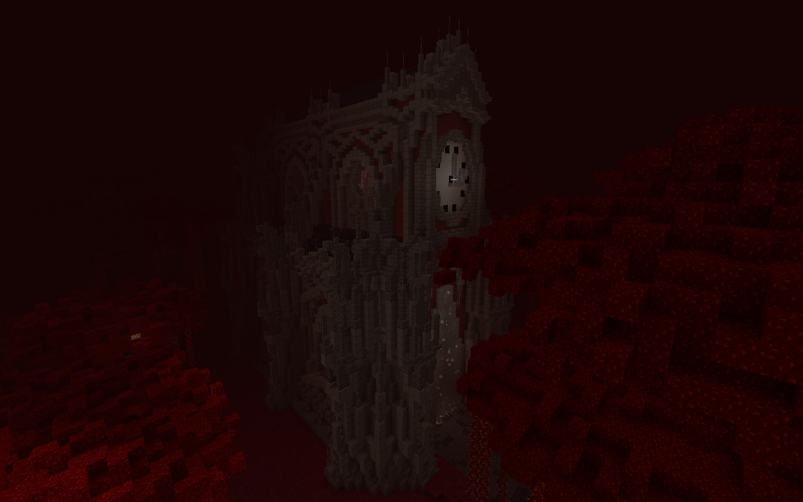

# 🎇 Welcome to Ignis

### 🔥 Welcome to **Ignis**

**Ignis** is the latest expansion in the **Dragon Shield Questline**, introducing a brutal new dimension built for high-level adventurers. This realm of flame and fury is packed with bosses, secrets, and challenges designed for party-based play.

<figure><figcaption></figcaption></figure>

> ⚠️ **Note:** This is a **pre-Durel** and **pre-Custom Ore** update.\
> You should be geared in **Silver** or **Netherite** before entering.\
> All Durel gear of old players is locked by this update, if yours isn't then\
> they're most likely old and should never be brought to Ignis to prevent data issues!

***

#### 🧭 How to Access Ignis

To begin your journey into Ignis:

1. **Complete a quest for Fennor** at Spawn.
2. After completing the quest, head to the portal at the **top of the Spawn stairs** behind **High Priest Theoklitos**.
3. **Right-click the portal** to enter Ignis.

> 🔥 **Important:** Ignis is **not** the Nether — it is a **custom-designed Hell Realm** with unique mechanics, enemies, and progression.

***

#### 🌋 What Awaits in Ignis

Ignis features **five distinct zones**, each with its own theme, mobs, and story elements:

1. **Crimson Rotten Mines** – The entry zone. Gather **Iridium** and prepare for what's to come.
2. **Weeping Valley** – A cursed graveyard filled with the spirits of fallen warriors.
3. **Crimson Forest** – An overgrown crimson island teeming with hostile life.
4. **Warped Islands** – Floating fragments haunted by **Wraiths** and **Warped Creepers**.
5. **Infernal Dunes** – The largest and most dangerous zone. A scorched wasteland of endless sand and burning nightmares.

Each zone includes:

* Optional **side bosses** with unique loot
* **Treasure mobs** that drop chests with coins and artifacts
* Hidden quests, lore, and **secret encounters**

> 🛡️ **Designed for Multiplayer:** While solo play is possible, enemies are **scaled for group combat**. Team up for the best experience!

***

#### 📊 Content Overview

* 🔥 **15+ Bosses**
* ✨ **30+ Unique Artifacts**
* 🗡️ **4 Custom Boss Weapons**
* 🤝 **Full multiplayer dungeon-style gameplay**

***

#### 🙏 A Note from the Marti

Ignis is the result of over **750 hours of development**, countless builds, and community support as well as high quality models we got from Vendors. I thank especially my favorite creator **LittleRoom** on all these amazing models which you'll see in the next sections, as well as most active supporters which sponsored the update through store purchases <mark style="color:purple;">**DS\_NS\_PS**</mark> and <mark style="color:orange;">**SieMC**</mark>. Thank you to everyone who has participated in making this update possible.\
\
We’ve tested extensively, but bugs may occur — if you encounter any issues, **please report them**.

This is only the beginning. A full **Wiki release** is coming soon to expand on Ignis mechanics, lore, and secrets.

> ⚔️ **Now go. Face the fire. Explore the unknown. Conquer Ignis**
