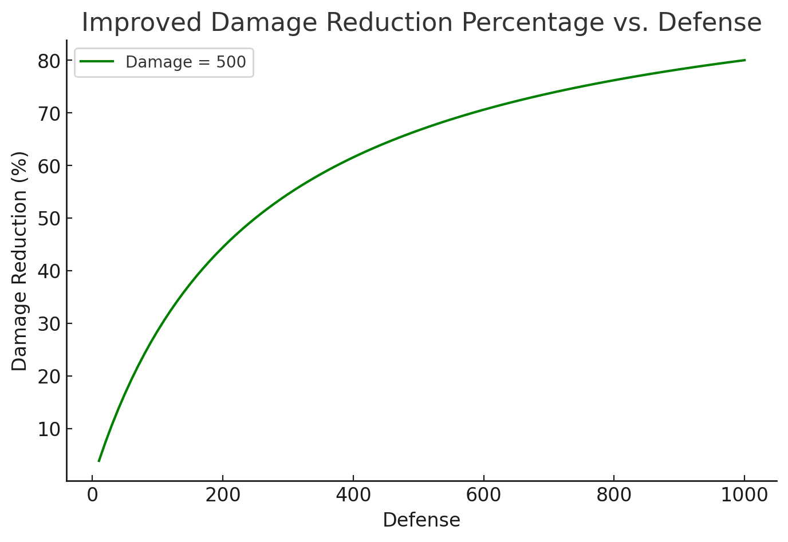

# 🦾 Defense System

In our system, defense helps reduce incoming damage, but it **never makes you completely invincible.** Instead of blocking a flat amount, defense reduces damage based on how much you have compared to the attack’s strength.

## The Formula

When you take damage, this formula is applied:

```
#damage# * (1 - (#defense# / (#defense# + #damage# * 0.4 + 50)))
```

## Breaking It Down .png>)

* The more defense you have, the less damage you take. Defense reduces incoming damage by a percentage instead of a fixed amount. This means high-damage attacks still deal some damage, even against tanks.
* Diminishing Returns – Defense gets less effective at higher values. Early defense upgrades make a big difference. Later on, stacking even more defense still helps, but the effect slows down.&#x20;
* **Even weak attacks will still do some damage.** The + 50 in the formula ensures that small attacks aren’t reduced to 0.

## Example Scenarios

### Example 1 - Medium Defense Vs. Attack

A player with 200 defense is hit by an attack that dealt 500 damage:

<figure><figcaption><p><strong>Final Damage = 278</strong></p></figcaption></figure>

Damage is reduced by \~44.4%, but the player still takes a good chunk of damage.

### Example 2 – High Defense Vs. Strong Attack

A 1000-defense player is hit by a 1000-damage attack:

<figure><figcaption><p><strong>Final Damage = 311</strong></p></figcaption></figure>

Damage is reduced by \~68.9%, but even tanks still take some damage from strong attacks!nuevo

## What This Means for You?

* Building defense is great, but <mark style="color:blue;">you won’t be invincible</mark>.
* Stronger attacks will always deal some damage, even against tanks.
* Defense has diminishing returns, so balancing offense and defense is key.

Here's some graphs to visualize this as well.

<div><figure><figcaption></figcaption></figure> <figure><figcaption></figcaption></figure></div>

To sum it up, <mark style="color:orange;">**the higher your defense, the higher the damage reduction**</mark>**.**&#x20;
