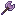
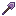
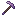

# 🗡️ Weapon and Tools

## &#x20; <mark style="color:blue;">Silver Gear</mark> &#x20;

Obtained by crafting, you need Netherite Sticks and <mark style="color:blue;">Silver Nuggets</mark> obtained in [Arg](arg/). The recipes are the normal minecraft ones. Silver Tools aren't faster than Netherite ones, they just do more overall damage.

<figure><figcaption></figcaption></figure>

It has 500 durability more than netherite and the same damage. All tools respect this too.

## .png>) <mark style="color:purple;">Iridium Gear</mark> 

Iridium Tools are crafted with netherite sticks and <mark style="color:purple;">Iridium Ingots</mark> which can be obtained in <mark style="color:red;">Crimson Rotten Mines</mark>, Iridium has overall 1+ attack damage over Silver and Netherite Tools as well as having 500+ extra durability over Silver.\

<figure><figcaption></figcaption></figure>
