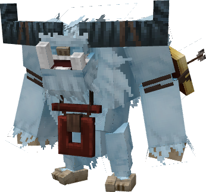
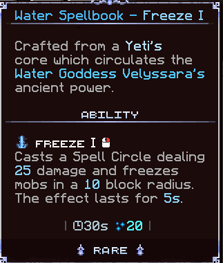
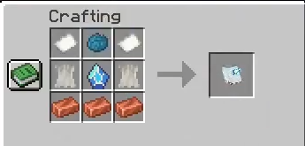

# ❄️ The Yeti

<figure><figcaption>
This guy doesn't chill!
</figcaption></figure>

* **Health:** 1250
* **Damage:** 20-35&#x20;
* **Where to find:** (only during snow storms)
  * Snowy Taiga&#x20;
  * Old Growth Birch Forest&#x20;
  * Old Growth Spruce Taiga&#x20;
  * Snowy Plains&#x20;
  * Frozen Peaks&#x20;
  * Grove Taiga&#x20;
  * Siberian Taiga&#x20;
  * Highlands Steppe&#x20;
  * Alpine Grove&#x20;
  * Snowy Maple Forest&#x20;
  * Snowy Cherry Grove&#x20;
  * Snowy Badlands&#x20;
  * Alpine Highlands Shield&#x20;
  * Wintry Lowlands
* **Recommended gear:** Enchanted Netherite (prot IV)

The abominable Yeti is a boss that spawns only in Aten, but that doesn't make him an easy foe to defeat.&#x20;

First of all, this hulking beast is powerful enough to launch you flying with his powerful arms. It can also breathe cold air at you, causing freezing over time. Lastly, this creature can pick up large amounts of snow and weaponize it.&#x20;

Some say that there's a way to stun this creature for a few seconds, but this last bit is just a rumor that has to be proven...

### Loot

* <mark style="color:blue;">**Yeti's Mana Core**</mark>, an unique item required to craft a Water Spellbook

<figure><figcaption></figcaption></figure>

#### And What is a Water Spellbook?

Great question! In Dragon's Shield there's a unique mana system where you can cast spells and skills from special items, and this spellbook is one of them, the very first one if I must add.

<figure><figcaption></figcaption></figure>

<figure><figcaption>
Water Spellbook
</figcaption></figure>

To craft this spellbook, you need the following items:

* A Yeti's Mana Core
* 3 Copper Ingots
* 2 pieces of Paper
* A piece of Cyan Dye
* 2 Timber Wold Paw Wool, droped from [Timber Wolves](https://app.gitbook.com/o/V9JJW6LzBqSnTmzT53Mm/s/6yr2oI9PwLQ7DW24nBxU/~/changes/264/worlds/overworld/about-aten/custom-mobs/timber-wolf)

<figure><figcaption>
Water Spellbook Recipe
</figcaption></figure>
