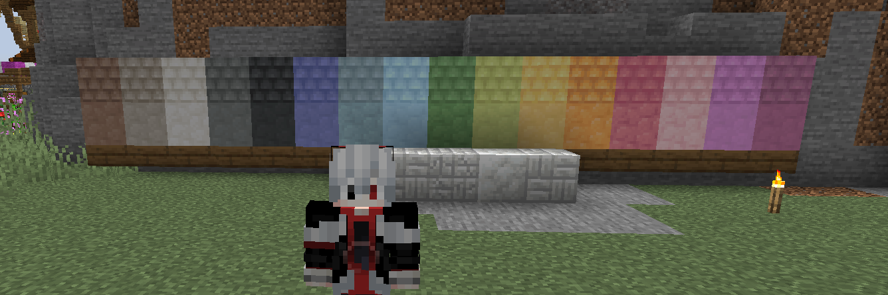

# 🧱 Custom Blocks

If you are the building type of player, then you're in luck! Here, you can get a brand new batch of building blocks to create some impresive structures to make your base, show off with your friends or even enjoy our regular competitions. Here's a small teaser of what you can find:

<figure><figcaption>
Brand new blocks (September 2024)
</figcaption></figure>

If you don't know how to get or craft these new blocks, here's a few tips on what you need to do:

* **Calcite** is now available in their polished variant (polished bricks, polished stairs and polished cracked bricks as well).
* **Silt**, a brand new material, can be crafted using Dirt and Calcite.
* **Packed Silt** can be crafted by mixing 8 Silt and one dye of your choice (color blocks!). You'll get 4 of these per craft.
* **Packed Silt Shingles** can be obtained by smelting Packed Silt.

### It's building time!

As of September 2024's update, the current prices of building blocks in /shop will be heavily reduced to encourage players to create some cool structures. Also, all the 36 new blocks included in that update will be available in the "Custom Blocks" section in /shop, so make sure to give it a look! Of course, more blocks will be added in the upcoming future, but in the meantime, you'll get a loot of options to create your base!
