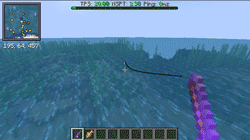

# 🐟 Custom Fishing

## How it works

Fishing Mechanics are fully re-worked on DS! Once you catch something a different minigame Will pop up on your screen! Each fishy has a different sell price which is based on it's rarity (which can be Normal, Silver and Gold) as well as the actual size of the fishy which is random. To sell the custom fish do either **/fm** or **/fishmarket**

## Fishing Gear

There's different fishing gear you can buy from the /shop and each one has a detailed explanation in it's lore so we won't be putting it in the wiki. Although something which is not in the wiki is the mechanics of some which I will cover here. To use a bait put it into your off-hand and throw your reel. When it comes to the hook just drag and drop it onto your rod. To fish in the nether you need a bone rod which can be bought from the shop.

## Type Of Fishing Games

&#x20;                                       **The Normal Basic Fishing Game**

<figure><figcaption>
Aww no fishy for you >:)
</figcaption></figure>

In some fishing games you have to hold down **SHIFT** for example the goal in this        one is to keep your fishy on the green bar until the bar up there fills up fully

<figure><figcaption>
Cmon! You can do it!
</figcaption></figure>

In this minigame you're supposed to get the fishy to the finish line while pressing shift to control it! But do be careful don't hold it for too long or the line will snap.

<figure><figcaption>
Go fishy go!
</figcaption></figure>
