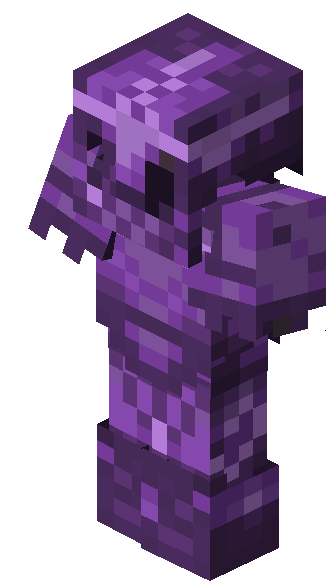
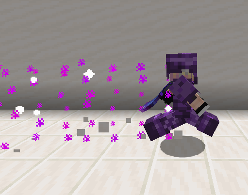
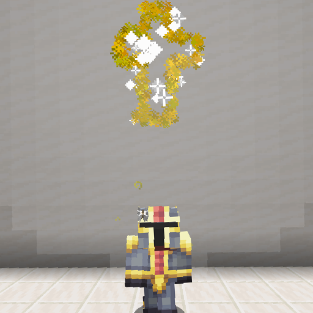

# ☄️ Items

## Weapons

 **Sharanga**

**Sharanga** is a bow which converts Spectral Arrows into Spectral bolts, which pierce infinite number of enemies and travel in a straight line. They also deal 20% more damage compared to regular Arrows. It is dropped by Illusioner in Strongholds. Unless Spectral Arrows are used as ammunition for this Bow, it has no special properties other than increased durability. When using Spectral Arrows as ammunition, they are converted into high velocity Spectral Bolts. Spectral Bolts can pierce an infinite number of enemies, inflicting Glowing for 10 seconds, while moving at 1.2x the speed of standard Arrows. Due to how arrow damage is calculated, this also means a 1.2x damage multiplier. Spectral Bolts travel in a straight line, being completely unnaffected by gravity. Spectral Bolts also explode after hitting a block, or after 1 second. The explosion deals 66% of base arrow damage with 20% armor penetration. It does not increase or decrease with draw time. Just like the Bolts, explosions inflicting Glowing for 10 seconds. Spectral Arrows have a 25% chance to not be used after being fired. This chance doubles with Infinity enchantment for a 50% chance to not be consumed.

 **Prismatic Punch**

**Prismatic Punch** is a post-Empress crossbow that converts arrows into slow, powerful Prismatic Blasts that home in on enemies, exploding when they come into contact with them. It also inflicts a new damage over time effect known as Prismatic Inferno.

Prismatic Punch transforms any shot Arrow into a powerful Prismatic Blast. They are slow and deccelerate over a timespan of 20 seconds until detonating. They can also bounce off walls.

Prismatic Blasts gain a huge speed bonus when an enemy is nearby, which they will target and home onto, detonating on contact. Explosions deal varying damage, between 4❤️❤️ and 10❤️❤️❤️❤️❤️ damage, while also dealing a bit of splash damage to entities around.

Multishot enchantment causes 3 different-colored blasts to be shot in a 50° cone. Piercing causes blasts to sometimes create secondary explosions on other nearby entities, with the max amount of extra explosions being directly defined by the enchantment level. Additional explosions from both Multishot and Piercing enchantments deal reduced damage.

To obtain it, trade the Holy Knights soul with the trade under spawn.

.png>) **Kaleidoscope**&#x20;

**Kaleidoscope** is a post-Holy Knight greatsword which charges itself while held. Attacking releases stored energy in a powerful area of effect discharge

Holding Kaleidoscope in main hand causes it to rapidly charge up. Current charge is displayed in player's action bar.

Attacking a mob resets the charge back to 0. If charge is under 33, nothing happens. However, if player's charge is above that amount, a powerful discharge is going to happen which deals extra damage with some splash damage as well. The discharge damage stacks with weapons's base damage of 7.

Kaleidoscope is unbreakable and cannot be repaired with an Anvil. However, Netherite Swords can be combined with Kaleidoscope to transfer enchantments.

To obtain it, trade the Holy Knight soul with the trader under spawn.

#### Chorus Dagger &#x20;

**The chorus dagger** is a unique weapon which allows you to sneak to warp to an enemy, dealing damage and speeding you up.

It has a base damage of 5, as well as an attack speed of 2.

To teleport you need to put your cursor on the enemy while holding the item in your main hand, this ability deals 8 damage and graces  the user with a speed buff.

To obtain it, break chorus plants for a random chance of it dropping from them instead of the plant.

#### .png>)Spectral Fury

**The Spectral Fury** is a unique ranged weapon which converts spectral arrow shots into wisps which seek out and attack mobs with  25% chance of returning the arrow to the player.

The wisps fly in a straight line until they find a target  to lock on, after hitting the target, they either chain  to another target, or come back to their previous target and attack him again. To use this ability, you need to charge the bow until you hear a special ping sounds.

To obtain it, trade the Holy Knight soul with the trader under spawn.

#### .png>)Prismember

The Prismember is a unique weapon which allows you to perform a fiery spin igniting all surrounding mobs in a radius, setting them on Prismatic Inferno.

It has a base damage of 8, as well as an attack speed of 1.6.

To  perform such spin you need to sneak while holding the weapon, and give it less than a second to charge, after which attack an enemy to use the swords ability, dealing damage and setting the foe on fire.

To obtain it, trade the Holy Knight soul with the trader under spawn.

#### .png>)Slayer Crossbow

The Slayer Crossbow is a unique ranged weapon which shoots energy bolts  with unlimited piercing, yet limited range.

The damaging energy  bolts are shot out of the crossbow no matter what arrow you choose to shoot with,  they deal about 7.6 damage and at a certain range, the bolt spreads giving it possible yet unpredictable AoE capabilities.

To obtain it, trade the Holy Knight soul with the trader under spawn.

#### .png>)Stellar Striker

The Stellar striker is a unique weapon which when held in main hand periodically collects stars, which can be used as damaging, armor-piercing projectiles which shoot in the direction you're facing.

It has a base damage of 10, as well as an attack speed of 0.9.

The stars deal about 7.7 points of damage and are able to be shot out while sneaking and attacking. They have a slight arc, yet are capable of being shot out quite far, you are able to have only 5 stars orbiting the player at a time. The player is unable to shoot them out while moving.

To obtain it, trade the Holy Knight soul with the trader under spawn.

#### .png>)The Beggining & The End

The Beggining and The End are two unique swords which allow the user to summon spirits when one of them is held in one hand, and when the user holds both of them at the same time, he's able to consume the spirits.

Both have a base damage of 5, as well as an attack speed of 2.

To consume the spirits, the user needs to point their cursor at said spirits, consuming them teleports the user to their location and attacks everything in a radius.

Holding The Beggining in the off hand, grants the user an extra point of attack, while holding The End in the off hand, grants the user +5% speed.&#x20;

Can be found in the end cities.

## Trinkets

 **Duskberry**

**Duskberry** is a post-Dragon trinket that grants increased Damage, Speed and Night Vision while held and curses player who eats it.

Duskberries can be found in Ships in End Cities, but only if they generate in The Hallow. They can be found in non-treasure Chests at an oddly specific 57.14% chance.

## Armor Sets

**Chorus Armor**

**Chorus Armor** is a post-Dragon armor set crafted with Chorus Plating. It is oriented around offense.

Wearing a full set of Chorus Armor grants player a set bonus, which increases damage on consecutive attacks up to 5 times.

While wearing a full set of Chorus Armor, players gain the ability to increase damage on consecutive attacks. Hitting an enemy increases the damage of the next attack by 5%. This stacks up to 5 times for a grand total of 25% extra damage. This boost lasts for 5 seconds before vanishing, unless another attack has hit a mob.

The set bonus extra damage stacks with the 10% extra damage from all armor pieces, meaning the actual damage increase is 35%.

The amount of damage stacks a player has is indicated by differently pitched hit sounds, with higher pitch being equal to higher damage multiplier.

Additionally, running with a full set of Chorus Armor will produce a purely cosmetic purple trail.While wearing a full set of Chorus Armor, players gain the ability to increase damage on consecutive attacks. Hitting an enemy increases the damage of the next attack by 5%. This stacks up to 5 times for a grand total of 25% extra damage. This boost lasts for 5 seconds before vanishing, unless another attack has hit a mob.

The set bonus extra damage stacks with the 10% extra damage from all armor pieces, meaning the actual damage increase is 35%.

The amount of damage stacks a player has is indicated by differently pitched hit sounds, with higher pitch being equal to higher damage multiplier.

Additionally, running with a full set of Chorus Armor will produce a purely cosmetic purple trail.

<figure><figcaption>
Chorus Armor trail seen while running
</figcaption></figure>

Pieces of Chorus Armor have a 33% chance to generate in any Chest found inside End Cities, except for the ones on Ships. It has an additional 36% chance to have random enchantments.

Each piece of Chorus Armor can also be crafted at the Altar of The Accursed, using 4/8/7/5 Chorus Plating.\

**Hallowed Armor**

.png>)

**Hallowed Armor** is a post-Dragon armor set crafted with Hallowed Ingots. It is oriented around mobility.

Wearing a full set of Hallowed Armor grants a set bonus, which allows for dodging of attacks with a cooldown.

Equipping full set of Hallowed armor will start a 20 seconds countdown. After reaching 0, player will get a buff - **Holy Protection**. Upon taking ANY damage, Holy Protection will set all incoming damage to 0 for next 5 seconds, as well as making player immune to all forms of knockback. Additionally, player will get Fire Protection and Water Breathing for next 8 seconds, as well as a short boost to Movement Speed that decays over timespan of 6 seconds.

This dodge has a cooldown of another 16 seconds. The initial 20 seconds is reapplied only when player takes off Hallowed Armor.

<figure><figcaption>
Dodging an attack with Hallowed Armor 
</figcaption></figure>

Pieces of Hallowed Armor have a 33% chance to generate in any Chest found inside End Cities, except for the ones on Ships. It has an additional 36% chance to have random enchantments.

Each piece of Hallowed Armor can also be crafted at the Altar of The Accursed, using 4/8/7/5 Hallowed Ingots

**Shulker Armor**

.png>)

**Shulker Armor** is a post-Dragon a direct upgrade to Netherite Armor. It is oriented around defense.

Wearing a full set of Shulker Armor grants player a set bonus with multiple benefits: 1. Shulker Bullets seek out anything that attacks the player. 2. Flat 20% damage reduction. 3. Immunity to Levitation and Wither debufffs.

However, Shulker Armor comes with a drawback in form of reduced movement and attack speed.

While equipped with a full set of Shulker Armor being damaged has a 33% spawns up to 3 friendly Shulker Bullets. They will automatically seek out nearby enemies, dealing 4❤️❤️ damage, as well as applying Levitation II for 5 seconds for extra fall damage

Wearer also becomes fully immune to Levitation and Wither debuffs.

Set bonus also applies permanent Resistance I, which is equal to flat 20% damage reduction.

Each piece of Shulker Armor can be crafted by combining any piece of Netherite Armor with 8 Shulker Shells over the Altar of The Accursed. Enchantments from the armor piece used to craft it will be transfered in the process, however properties like custom name or other NBT modifications will be lost.

Miscellaneous

.png>) **Golden Chorus Fruit**

**Golden Chorus Fruit** is a rare food item found in End Cities which teleports player to a random location when eaten

Players who eat the Golden Chorus Fruit are randomly teleported to any location in a 2500 blocks radius around them.

Golden Chorus Fruit works in all dimensions, including modded ones.

Golden Chorus Fruit has a 14% chance to generate in End Cities in Top Tower chests. Up to 2 can generate in one chest.

## Spellbooks

 Book of Updraft

**Book of Updraft** is a spellbook which pushes its user upwards when used and gives them the ability to freely glide for a couple of seconds.

Book of Updraft has a 15% chance to be dropped by Evokers in [Strongholds](https://stellarity.kohara.xyz/wiki/items/structures/stronghold.md). This chance is boosted by 3% for every level of Looting, for a maximum of 21%. However due to the drop being randomly chosen between Book of Conveyance, Light and Updraft, this chance is about ⅓rd of this.

Librarians in End Villages can turn any Enchanted Book into Books of Updraft for 64 Emeralds.

Right-clicking gives its user immense vertical boost of about 22.5 blocks. Afterwards they are given the ability to glide for 7 seconds. After glide expires, Slow Falling is given until landing.

Glide can be cancelled earlier by sneaking.

This has a cooldown of 16 seconds, which starts counting **after** landing.

 Book of Light

**Book of Light** is a support spellbook which creates a healing aura around its user, giving all players inside health regeneration and damage reduction.

Book of Light has a 15% chance to be dropped by Evokers in Strongholds. This chance is boosted by 3% for every level of Looting, for a maximum of 21%. However due to the drop being randomly chosen between Book of Conveyance, Light and Updraft, this chance is about ⅓rd of this.

Librarians in End Villages can turn any Enchanted Book into Books of Light for 64 Emeralds.

Right-clicking creates a healing aura with a radius of 5.5 blocks. Any player who steps inside will get Regeneration II and Resistance I. They will also be cured from Weakness and Slowness debuffs.

Aura lasts for 17 seconds. There is a 48 second cooldown between creating different auras.

 Nature's Wrath

**Nature's Wrath** is a post-Dragon spellbook which can either shoot a homing Nature's Spirit with limited range when right clicked or summon a pack of Spirit Wolves when used while sneaking. Both abilities can be upgraded by visiting certain biomes while holding the book.

Librarians in End Villages can turn any Enchanted Book into Nature's Wrath for 12 Oak Saplings. However, only half of them sell the Spellbook.

Right-clicking shoots a slow Nature's Spirit, which automatically homes in on nearby enemies, dealing 4❤️❤️ damage. Spirits don't require any ammunition to be fired and they last for 1.5 seconds before disappearing. Spirits cannot home onto players in PvP and cannot damage Wolves.

Visiting certain biomes **while holding Nature's Wrath in any hand** imbues it with a fraction of the biome's power, enhancing the Spirits and adding new types of Spirits which can be fired. The amount of Spirits different from the default one which Nature's Wrath can fire will from now on be referred to as `amount of Spirit Upgrades`.

<table data-full-width="true"><thead><tr><th width="173">Spirit Upgrades</th><th>Color</th><th width="145">Biome</th><th>Damage</th><th width="183">Armor Penetration</th><th width="123">Effects</th><th width="172" align="center">Notes</th><th data-hidden></th></tr></thead><tbody><tr><td>Normal</td><td>Light Blue</td><td>❌Default</td><td>4❤️❤️</td><td>❌</td><td>❌</td><td align="center">Damage increased to 6❤️❤️❤️ at 5  Spirit Upgrades</td><td></td></tr><tr><td>Forest</td><td>Dark Green</td><td>Any Forest Biome</td><td>5❤️x 2.5</td><td>❌</td><td>Grants 4💛💛points of Absorption for 8 seconds</td><td align="center">Moves 10% quicker Absorption amount doubled at 6 total spirit upgrades</td><td></td></tr><tr><td>Fire</td><td>Orange</td><td>Any Nether Biome</td><td>5❤️x 2.5</td><td>❌</td><td>Sets Target on fire for 3 seconds</td><td align="center">Fire Duration is extended by 5 ticks for every Spirit Upgrade does not work on players in PvP</td><td></td></tr><tr><td>Jungle</td><td>Light Green</td><td>Jungle, Bamboo Jungle</td><td>7❤️x 3.5</td><td>10%</td><td>Inflicts Poison I for 11 seconds</td><td align="center">At 5 Spirit Upgrades, Poison duration is reduced to 7 seconds, but potency increased to II At 8 Spirit Upgrades, Poison Duration is reduced to 5 seconds, but potency is increased to III Moves 15% quicker</td><td></td></tr><tr><td>Ocean</td><td>Pink</td><td>Any Ocean Biome</td><td>5❤️x 2.5</td><td>❌</td><td>Grants Regeneration I for 13 seconds</td><td align="center">At 7 Spirit Upgrades, Regeneration duration is reduced to 7 seconds, but potency is increased to II Moves 10% slower Ignores speed penalty in liquids</td><td></td></tr><tr><td>Mountain</td><td>Yellow</td><td>Any Mountain Biome</td><td>7❤️x 3.5</td><td>15%</td><td>❌</td><td align="center">Moves 30% quicker</td><td></td></tr><tr><td>Snow</td><td>White</td><td>Any Snowy Biome</td><td>4❤️❤️</td><td>❌</td><td>Inflicts Slowness I for 6 seconds and Weakness I for 2 seconds Has a 66% chance to inflict Frostburn for 2 seconds</td><td align="center">Fire duration is extended by 4 ticks for every Spirit Upgrade</td><td></td></tr><tr><td>Swamp</td><td>Brown</td><td>Swamp, Mangrove Swamp</td><td>5❤️x 2.5</td><td>❌</td><td>Inflicts high knockback</td><td align="center">Does not work on players in PvP</td><td></td></tr><tr><td>Sculk</td><td>Black</td><td>Deep Dark, Skulk Growth</td><td>11❤️x 5.5</td><td>15%</td><td>Deals high splash damage to nearby entities</td><td align="center">❌</td><td></td></tr><tr><td>Hallowed</td><td>Blue</td><td>The Hallow</td><td>9❤️x 4.5</td><td>❌</td><td>Deals 14❤️❤️❤️❤️❤️❤️❤️ damage to undead mobs Creates a small explosion which doesnt destroy blocks</td><td align="center">❌</td><td></td></tr></tbody></table>

By default there is a 50% chance to shoot a regular Spirit _(33% if above 7 Spirit Upgrades)_. If not, then a random Spirit from all Spirit Upgrades will be chosen. However, certain Spirit types have a higher chance to be chosen depending on some circumstances:

* Ocean Spirits are 4x more likely to be chosen if user is underwater.
* Mountain Spirits are 3x more likely to be chosen if there are mobs in a 13-23 block radius around the player, but no mobs in a 13 block radius
* Hallowed Spirits are 2x more likely to be chosen if there are are more than 3 undead mobs in a 8 block radius around the player
* Sculk Spirits are 2x more likely to be chosen if there are more than 5 mobs in a 9 block radius around the player

Spirtis can be fired every 1.2 seconds. Each Spirit Upgrade also reduces cooldown at which Nature's Wrath fires by half a tick. Due to rounding of scoreboards in Minecraft, this means that for every 2 Spirit Upgrades, the cooldown will be reduced by 0.05 seconds

Sneaking and right-clicking casts an alternate ability, which summons a pack of Spirit Wolves. They act like regular tamed dogs, however they deal more damage, move quicker and have a bit more health. They automatically despawn after 20 seconds.

The number of Spirit Wolves spawned, as well as their stats, is directly tied to the number of Spirit Upgrades. By default, only 2 will spawn, with 3rd one being spawned at 3 Spirit Upgrades, 4th one at 6 and finally 5th one at 9.

<table><thead><tr><th width="265">Number of Spirit Upgrades</th><th>Health</th><th>Damage</th><th width="231">Extra Movement Speed</th><th width="84">Armor</th><th width="203">Armor Toughness</th><th width="224">Knockback Resistance</th><th data-hidden></th></tr></thead><tbody><tr><td>&#x3C; 2</td><td>16</td><td>4</td><td>4%</td><td>1</td><td>❌</td><td>❌</td><td></td></tr><tr><td>2-3</td><td>18</td><td>5</td><td>10%</td><td>2</td><td>❌</td><td>5%</td><td></td></tr><tr><td>4-6</td><td>20</td><td>6</td><td>16%</td><td>3</td><td>1</td><td>10%</td><td></td></tr><tr><td>7-8</td><td>22</td><td>7</td><td>22%</td><td>4</td><td>1</td><td>15%</td><td></td></tr><tr><td>9</td><td>24</td><td>8</td><td>28%</td><td>5</td><td>2</td><td>20%</td><td></td></tr></tbody></table>

After Spirit Wolves despawn, there is a 20 second cooldown before they can be summoned again

## Materials

### Pixie Dust

**Pixie Dust** is a post-Dragon crafting material dropped by Pixies.

Pixies drop 0 - 4 Pixie Dust when killed. Pixie Dust can also be found in End Ships in place of Glowstone Dust, but only if they generate in The Hallow.

Pixie Dust can be used at the Altar of The Accursed to craft .png>)Sariel, or in regular crafting recipes in place of Glowstone Dust.

It can also be offered as a sacrifice at the Chapel of Light, which summons the Empress of Light boss.

### .png>) Chorus Plating

**Chorus Plating** is a post-Dragon crafting material used solely to craft Chorus Armor.

Chorus Plating can be found inside any Crate fished up via Void Fishing or Chests in Dungeons and End Cities.

Armorers, Weaponsmiths and Toolsmiths in End Villages have a chance to sell 4 Chorus Plating for 12 Emeralds.

Combining 5, 8, 7 or 4 Chorus Plating with Netherite Items over the Altar of The Accursed crafts a piece of Ancient Armor.

###  Hallowed Ingot

**Hallowed Ingot** is a post-Dragon crafting material used solely to craft Hallowed Armor.

Hallowed Ingots can be found inside any Crate fished up via Void Fishing or Chests in Dungeons and End Cities.

Armorers, Weaponsmiths and Toolsmiths in End Villages have a chance to sell 4 Hallowed Ingots for 12 Emeralds.

Alternatively, an Iron Block can be consecrated into 2 Hallowed Ingots.

Combining 5, 8, 7 or 4 Hallowed Ingots over the Altar of The Accursed crafts a piece of Hallowed Armor.\
\

