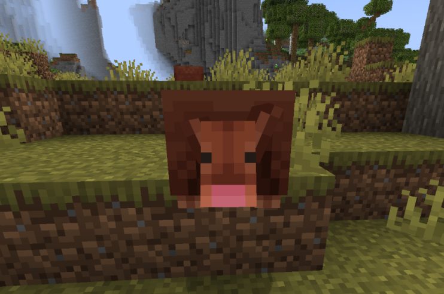

# 🏜️ Armadillo

Armadillos can also be found in Aten. Be careful around these Shy fellows.

<figure><figcaption></figcaption></figure>

Although these cute little guys do not drop anything they can be tamed when below 30% HP by feeding them a spider eye.

These little balls of anxiety roll up in a ball when an armadillo is hit in the area. They do this in real life as a defense mechanism in order to hide itself from its attackers and to make a trap. The inside of their hiding pace is actually soft and hairy skin.

These loveable little attack balls spawn in 8 different biomes. These are:

* Plains
* Savannas
* Savannas Plateau
* Arid Highlands
* Sandstone Valleys
* Savanna Badlands
* Savanna Slopes
* Skylands Sutum

