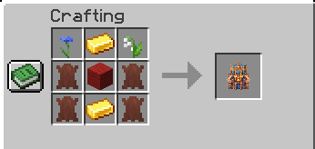

# 🐗 Boar

<figure><figcaption>
Wild boars in Aten
</figcaption></figure>

A cousin of the pig, but much more aggresive and potentially dangerous for unaware adventurers. These tusked animals tend to appear in big numbers, each with 20 HP, with a chance of an alpha member much more stronger than their regular counterparts (50 HP). You can find these angry beasts in the following biomes:

* Forests
* Snowy Taigas
* Old Growth Birch Forests
* Arid Highlands
* Hot Shrublands
* Orchid Swamps
* Highlands
* Alpine Highlands
* Brushlands
* Shields

As most unique creatures in Aten, boars can drop two items that can be useful for crafting unique items. The first is the Boar Meat, which can be smoked, restores 7 hunger and 6 saturation, and provides a short-duration speed buff.

The second item is the Boar Wool, which can be used to craft a brand new Boar Backpack. This backpack is one row smaller than the buffalo backpack, making it a great choice for new players to get  an improved way to carry their items.

<figure><figcaption>
Recipe to craft Boar Backpack
</figcaption></figure> <figure><figcaption>
Quite a fancy backpack, isn't it?
</figcaption></figure>

