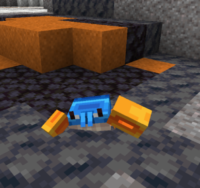

# 🦀 Crab

These cute little blue crabs spawn in Aten too.

<figure><figcaption></figcaption></figure>

These cute little guys like to dance and wave at you. They to can be tamed when below 30% HP but they need to be fed rotten flesh.

These adorable dancers drop a fully functioning claw which works just like how mojang advertised it.

They spawn in 3 different biomes. These are:

* Mangroove Swamps
* Yellowstone
* Yosemite Cliffs
