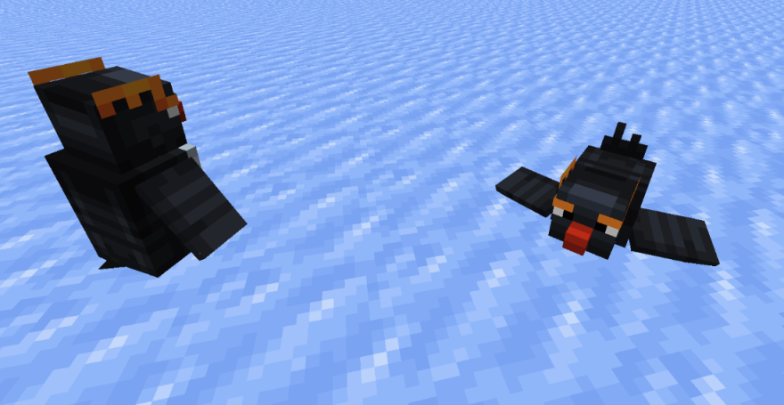

# 🐧 Penguin

Another Cute Mob that likes to waddle around in Aten are penguins.

<figure><figcaption></figcaption></figure>

These cute little beans just like to live their best life by sliding around and eating raw cod all day. The good news for penguin lovers is that these little guys can be tamed when below 30% HP by feeding them their favourite food raw cod. They only have 12HP so be careful to not cause their demise.

These cute passive mobs like to spawn in cold biomes such as:

* Frozen Rivers
* Snowy Plains
* Frozen Oceans
* Deep Frozen Oceans
* Ice Spikes
* Snowy Taigas
* Snowy Slopes
* Snowy Beaches
* Frozen Cliffs
* Skylands Winter
* Snowy Cherry Grove
* Wintry Forest
