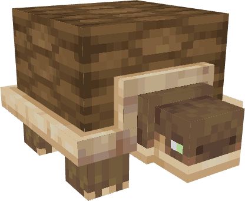

# 🐢 Tortoise

<figure><figcaption></figcaption></figure>

One generally docile creature, but can attack back if provoked. It has a whooping 200 HP and 25 damage, and it has the ability to hide in its shell to void any damage, so time your attacks very well.

This creature can spawn pretty much near any warm beach, so you will have no major issues encountering one.

### Loot

* Turtle Shell, an item required to craft a Tortoise Backpack.

<figure><figcaption>
Tortoise backpack; requires Buffalo Skin, Amber Ingots, a Tortoise Shell and Gray Wool.
</figcaption></figure>
