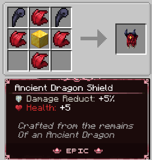

# 🐲 Ancient Dragons

<figure><figcaption>
Big, red, angry, scaly puppy
</figcaption></figure>

### Spawning

These Dragons spawn from 10k and above in Durel. Their spawn conditions are setup so they can spawn in a 3x3 area around the player. They can also spawn in caves, in water, and basically on any surface.&#x20;

### Stats

Their HP scales with the distance from 0.0, this means their hp increases every 25 blocks by a 50x multiplier. Their HP can reach towards 100.000HP on 20k Durel Cords. Their damage doesn't scale and varies from attack to attack (40-70).

### Drops

These guys have a 70% chance to drop 1-2 Ancient Dragon Teeth, and have a 75% chance to drop 1-3 Ancient Dragon Scales. These items can be used to craft an Ancient Dragon Shield. \
The Ancient Dragon Shield has 3000 durability, gives 5% damage reduction alongside 5 extra hp. It's very useful for a tank build.

<figure><figcaption>
Ancient Dragon Shield
</figcaption></figure>

**Overall recommended armor for this fighting these beasts is Amber or stronger, as they're hard hitters and can avoid attacks.**
