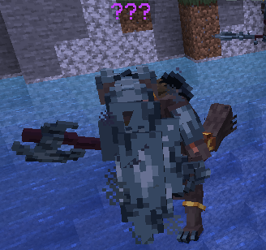

# 🛡️ Gnolls

* **Gnoll Spearsman:** a foot soldier capable of mid-range attacks. Can reach you before you reach them with a sword! They can also jump at you and take a big chunk of health from a single strike.

<figure><figcaption>
Gnoll Spearsman
</figcaption></figure>

* **Gnoll Berserker:** a specialized short-range attacker that can deal heavy blows with its axe, with a chance of inflicting bleeding, an incurable DoT. Some Berserkers may have shields to stop incoming attacks, however this skill has cooldown, so timing your best attacks against them is key.

<figure><figcaption>
Gnoll Berserker (No Shield)
</figcaption></figure>

<figure><figcaption>
Gnoll Berserker (With Shield)
</figcaption></figure>

* **Gnoll Archer:** a highly mobile Gnoll warrior that can shot arrows very quickly, even many arrows at the same time! It ensures to keep their distance by smashing you with their bow, so you won't be able to reach them.

<figure><figcaption>
Gnoll Archer
</figcaption></figure>
