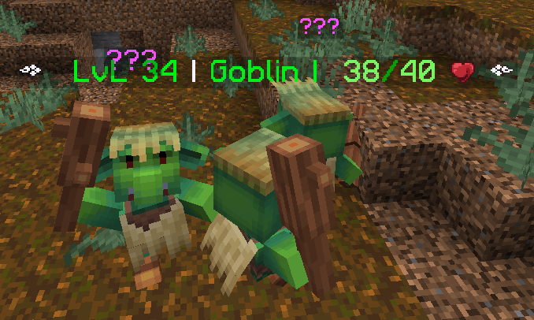

# 👺 Goblins

One of the factions that roams the world of Durel, weak in strenght but big in numbers. There are five members into this faction:

* **Goblins:** small footsoldiers armed with clubs and capable of swift group attacks. Not a big threat, unless you are cornered by many of them. Also, they are capable of disabling shields.

<figure><figcaption>
Goblin
</figcaption></figure>

* **Goblin Archer:** a rookie trained in the use of long-range weapons. Arrow shots may be slow, but they can pierce through shields.

<figure><figcaption>
Goblin Archer
</figcaption></figure>

* **Goblin soldier:** a stronger version of the standard Goblin. Well-armed with a sword and shield, they are more resistant than regular goblins, but they are a lot slower. However, they can ambush you from behind and sink you in the ground for a few seconds, so stay on your guard!

<figure><figcaption>
Goblin Soldier
</figcaption></figure>

* **Goblin shaman:** a spell-casting goblin capable of launching long-range explosive attacks and heal their team members. Must be your first target if you're planning to defeat a goblin group.

<figure><figcaption>
Goblin Shaman
</figcaption></figure>

* **Goblin king:** leader of the goblins, always on top of a massive tortoise and capable of launching a powerful slam attack. Can call back-up, so defeating it as quick as possible is a must, but may not be an easy task, as he has four more times HP than other goblins.

<figure><figcaption>
Goblin King
</figcaption></figure>
