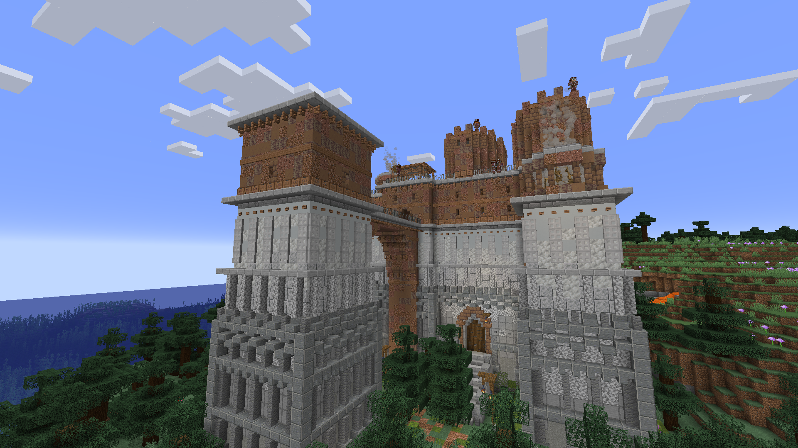

# 🗼 Granite Fort

**Found in:&#x20;**<mark style="color:orange;">**Arg**</mark>, <mark style="color:red;">**Durel**</mark> (Very rarely in <mark style="color:blue;">**Aten**</mark>)

This is one imposing structure found most commonly in Plains and Forests. Be extremely careful exploring this place, as there are bandits around all corners, as well as a massive pit filled with spikes!

### Tips

* There are rumours of a hidden "golden" treasure in this fort...
* Some unique tools and potions can be found here.

<figure><figcaption></figcaption></figure>
