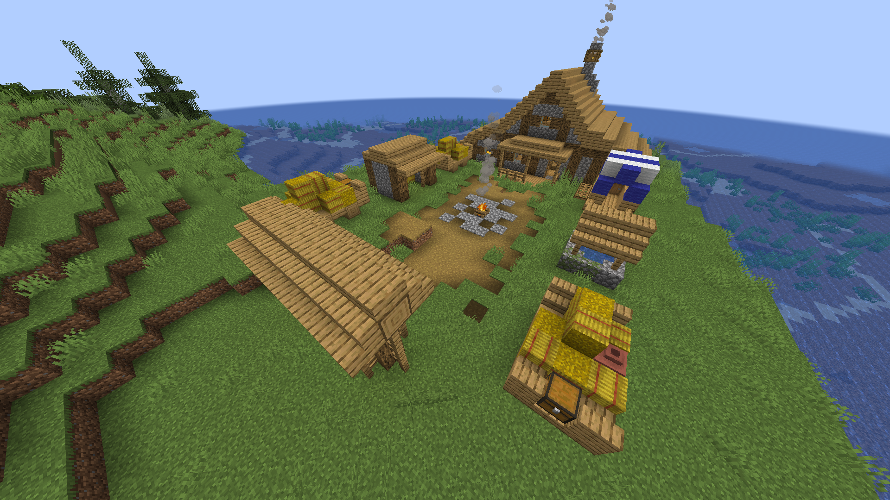

# 🏘️ Tavern

**Found in:** All Overworld.

Another common structure, where a couple villagers receive adventurers all over the world and where they can have a rest. Some stories are usually told here about great dungeons filled with loot.

<figure><figcaption>
Oak Tavern
</figcaption></figure>

### Items to obtain

* Iron ingots, emeralds, iron tools.

### Notes

* Taverns can come in different forms and shapes, depending on the biome where they spawn.
* Dark forest taverns are filled with hostile illagers. Caution is adviced.
