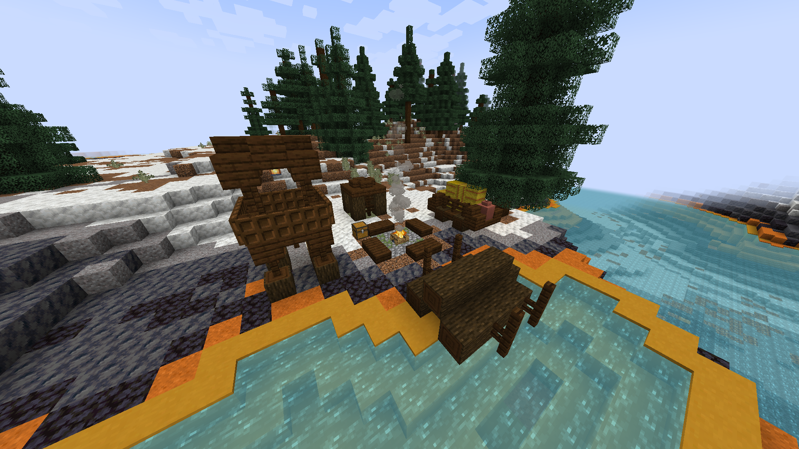
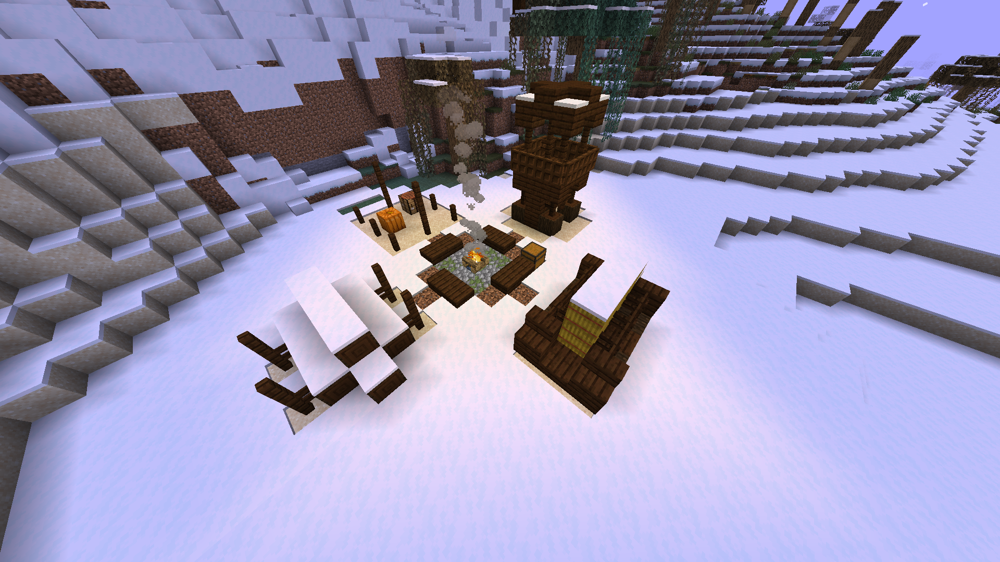

# 🏕️ Illager Camp

**Found in:&#x20;**<mark style="color:orange;">**Arg**</mark>, <mark style="color:red;">**Durel**</mark> (Very rarely in <mark style="color:blue;">**Aten**</mark>)

A very common structure found all over the world, where around 3 to 5 illagers gather before continuing their explorations. They may have a few captured villagers, although this is not common to be seen.

<figure><figcaption>
Illager Campsite in Yellowstone biomes
</figcaption></figure> <figure><figcaption>
Illager Campsite in Taiga biomes
</figcaption></figure>

### Items to obtain

* Gold ingots, iron ingots, emeralds, iron tools.
