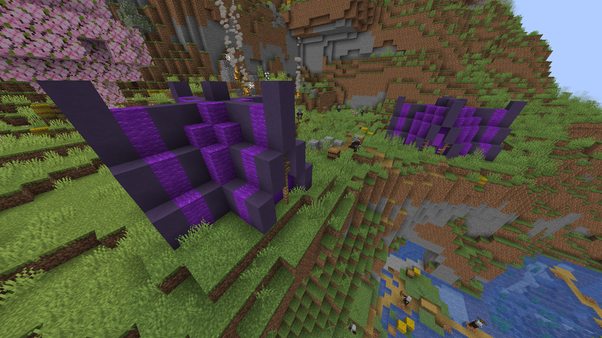

# 🏕️ Illager Campsite

**Found in:** All Overworld

This is where the illagers rest between raiding the villager's houses, which means it can be found in almost all biomes in the overworld. The number of illagers you may find in these structures can be notably huge and overwhelming, so explore with caution. Sometimes, you may find one or two zombie villagers around the campsite.

.png>)

### Items to obtain

* Iron ingots, Emeralds.
* Iron gear.
* Goat Horns.
* Gold raw ores (scattered around the campsite).
* Vex Trims.
