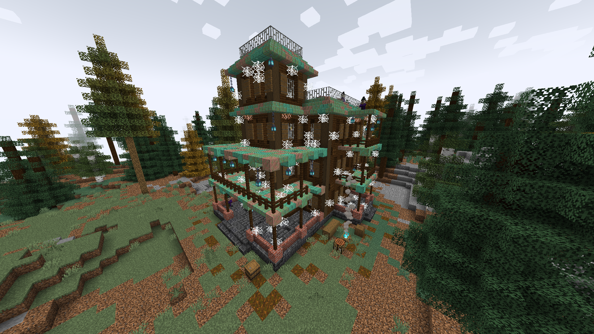

# 🏕️ Witch Manor

**Found in:** All Overworld

A sort of old hut found mainly in taiga and dark forests biomes. As their name implies, their inhabitants are a group of witches and a few spiders that they keep as pets. However, they hold some interesting books for enchanting purposes, and sometimes they held Allays as hostages, pretty much like the other Illagers.

### Items to obtain

* Iron ingots, gold ingots, emeralds.
* Low-grade enchanting books.
