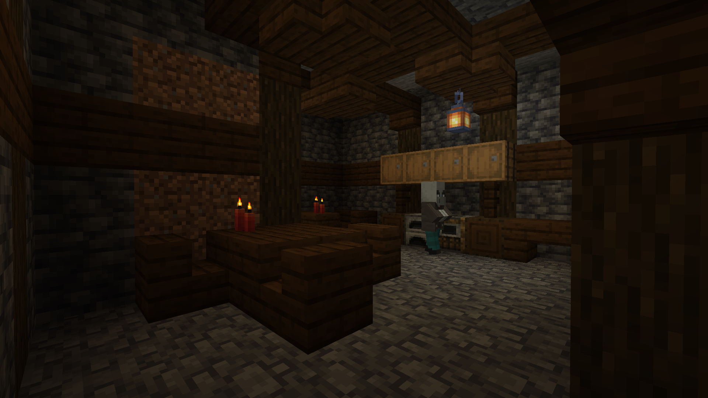
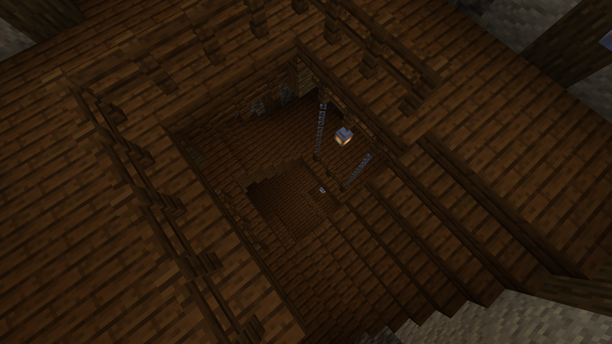
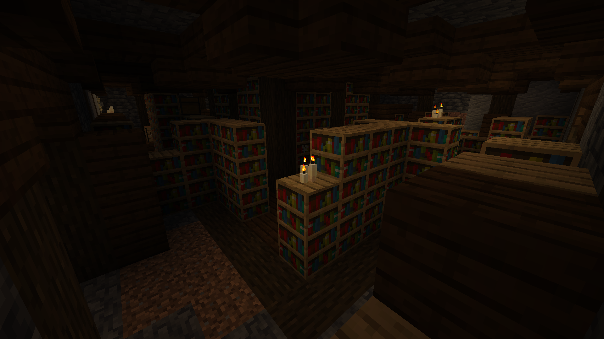
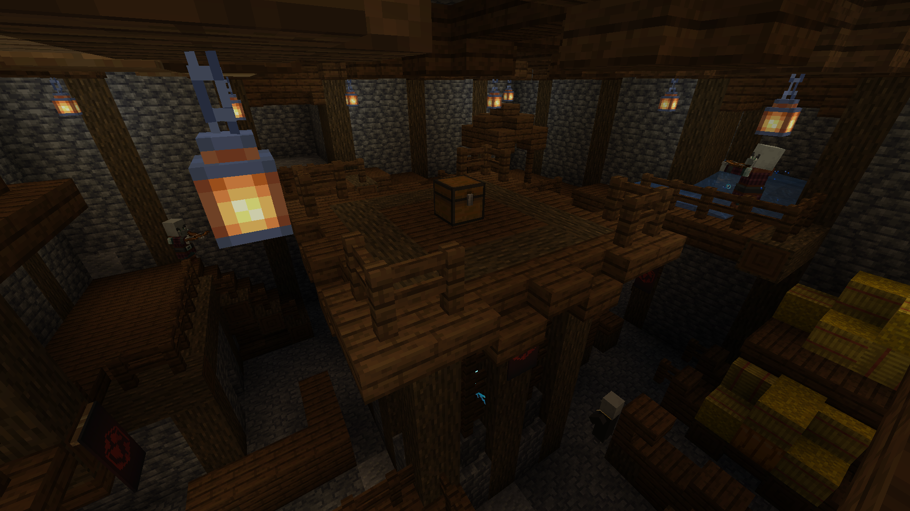

# ⭕ Illager Hideout

**Found in:&#x20;**<mark style="color:orange;">**Arg**</mark>, <mark style="color:red;">**Durel**</mark> (Very rarely in <mark style="color:blue;">**Aten**</mark>)

An extremely rare dungeon known by many, yet found almost by nobody. This is one of the many places where pillagers stash their treasure after raiding villages. Worth to check what kind of loot they  got!

<figure><figcaption></figcaption></figure> <figure><figcaption></figcaption></figure>

<figure><figcaption></figcaption></figure> <figure><figcaption></figcaption></figure>

Items to obtain

* Gold ingots, iron ingots, emeralds, diamonds, iron tools.
* Gold blocks (treasure room only).

### Tips

* This structure cannot be found above ground, and it only spawns around Y=0 on Plains and Taiga biomes.
