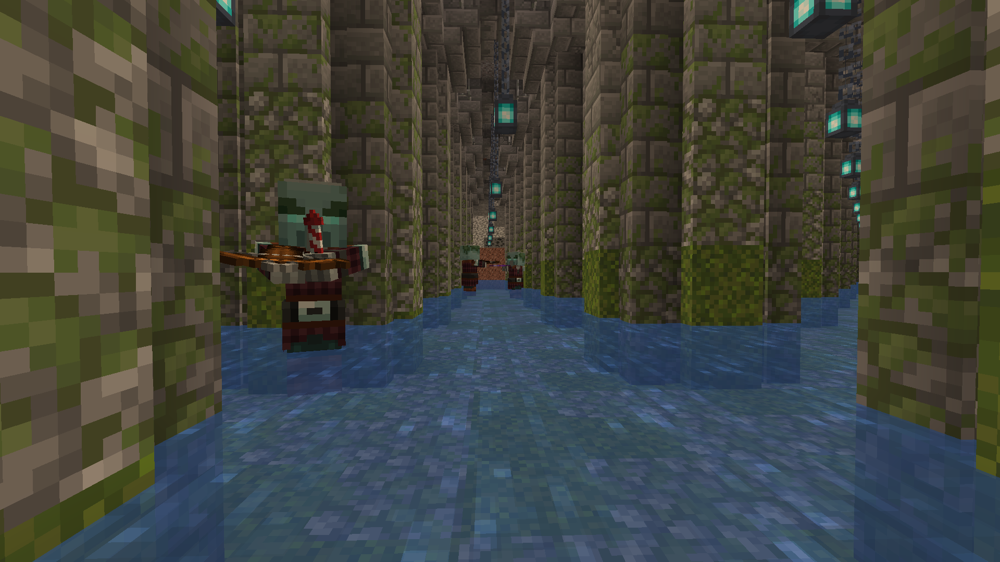
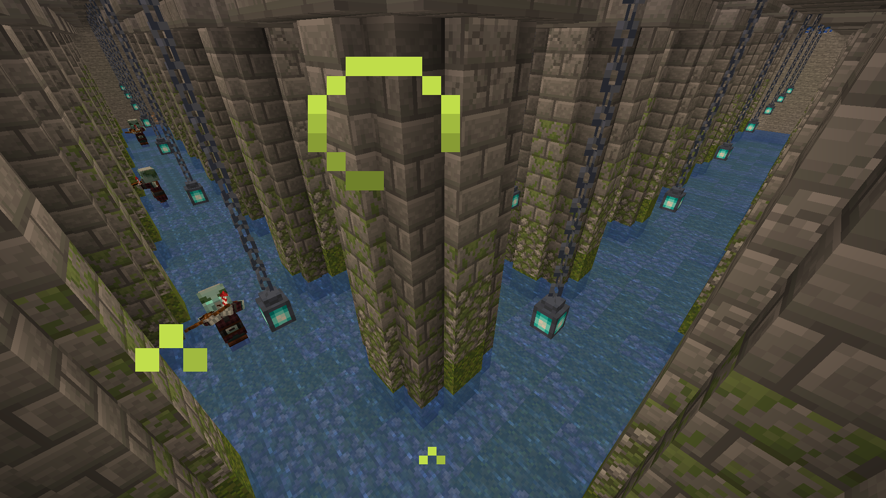

# ⭕ Underground Monument

**Found in:&#x20;**<mark style="color:orange;">**Arg**</mark>, <mark style="color:red;">**Durel**</mark> (Very rarely in <mark style="color:blue;">**Aten**</mark>)

Have you ever thought how does a land-made monument look like? Well, this place may give you an idea. Keep an eye of the very dangerous illagers that are lurking around.

<figure><figcaption></figcaption></figure> <figure><figcaption></figcaption></figure>

### Notes

* A very unusual potion can be found in this dungeon.
